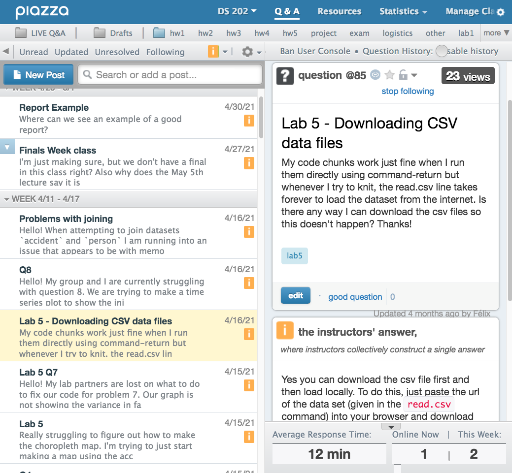

class: middle, big, red

```{r xaringan-tile-view, echo=FALSE}
xaringanExtra::use_tile_view()
```

# Course overview

---

## Statistical Computing

- STAT 486 is your first systematic study of statistical programming

- Cross-listed as STAT 586 for graduate students

- You will learn very important skills to deal with data and analysis. These skills will be repeatedly used in your career!

- You will learn R


---

## What is statistical computing?

Common tasks of a statistician/data scientist at work or in future study:

- You are given data and asked to look at data
  - generate numerical and graphical monitoring reports
  - diagnose problems in your dataset

- You are given a problem that you must answer from the data
  - what is the chance that ...?
  - does A explain B?
  - how well can we predict something?

- Your tasks are repetitive

- Your analysis and report must be reliable and reproducible

We are going to use **programming** to solve these.

---

## What is this course about?

You will acquire solid programming skills where your statistician/data scientist career will be built upon. In particular,
- R fundamentals
  - syntax, data types, control loops
  - numerical and graphical summaries
  - functional programming
  - writing reliable code
- Simulation
  - generate random numbers and sampling
  - statistical inference using simulation
- Statistical and machine learning models
  - regression
  - classification
- Production tools using tidyverse
  - advanced data visualization
  - data wrangling
  - combining data sources

... we will be using R for that!

---

## R is ...

* One of the most popular statistical/data science programming languages

* __Free__ to use, __open source__ so you can see what code is doing to your data

* __Powerful__ for data analysis
    * With the right tools, get more work done, faster
    
* __Extensible__: More than 18000 user contributed add-on packages currently on CRAN! Bioconductor more than 2000 packages. Many researchers provide R packages through github

* __Flexible__
    * Not a question of _can_, but _how_

```{r, eval = FALSE, echo = FALSE}
devtools::install_github("metacran/crandb")
pkgs <- crandb::list_packages(limit = 999999)
length(pkgs)
# [1] 15352
```

---

## Why to learn R when we have SAS?

- R is free and fully customizable

- R can do so much more

- You can interact with R objects and results in an intuitive manner 

- R is more popular

---

## Why to learn R when we have Python?

- R has almost everything built in for data analysis

- R is built by statisticians and data scientists and has many models available in user-contributed packages

- R can create excellent visualization

- R is a functional programming language, so you can write short code to do a massive lot  

---


## Course logistics

- All lectures will be recorded. Slides and code demonstration will be made available

- Attendance will not be taken, but you will finish weekly quizzes which covers materials specifically covered in the lecture

- Bring your laptop to the lecture

- Please **wear a mask in class**, and be vaccinated 

---

## Getting help

- In class: Raise your hand

- Office hour: Office hour will be held on Zoom [here](https://iastate.zoom.us/j/93009772568?pwd=aWlWWHN0SmN2U011K3BiejhFK3E4Zz09). The phisical location is to be announced

- Googling

- We will use [Piazza](piazza.com/iastate/spring2022/stat486586) for *all* course-related Q & A

- Email is only for personal matters

---

[Piazza](https://piazza.com/iastate/spring2022/stat486586) will be used as the class' online forum, which is accessible within Canvas. 



We are using a free contribution-supported mode. Making contribution to Piazza is **completely optional**

 
---

## Asking a good question

is a learned and valuable skill! Please

- Be polite and respectful to others

- Search before you post. Your question may have already been asked and answered

- When you post a question, please explain the context and give an example of what you have issue
with. Posting screenshots and asking "What is going wrong?" is unacceptable

- Providing a [reproducible example](https://stackoverflow.com/questions/5963269/how-to-make-a-great-r-reproducible-example) will greatly help others help you

- Posting short snippet of code is fine, but please refrain from posting a complete solution to a question

Have a look at:

- stackoverflow's [Asking a good question](http://stackoverflow.com/help/how-to-ask)

---

## What do you know already?

- SAS? R? R markdown?

- another programming language?

- STAT 301 or STAT 326 or STAT 401 or STAT 587?

- Multiple linear regression?

- Matrix calculation (linear algebra)?


<!-- ## What data will we look at? -->

<!-- Go to Google Forms to let me know your favorites and make suggestions: -->
<!-- https://forms.gle/oWABftKzyfy2Skdp7 -->

<!-- Anything else you can think of? -->


<!-- ## What data will we look at? -->

<!-- Go to Google Forms to let me know your favorites and make suggestions: -->
<!-- https://forms.gle/j3cWwu3Q9Be33e7T6 -->

---

## Syllabus

The [full syllabus](https://canvas.iastate.edu/courses/88184/assignments/syllabus) can be found on Canvas

