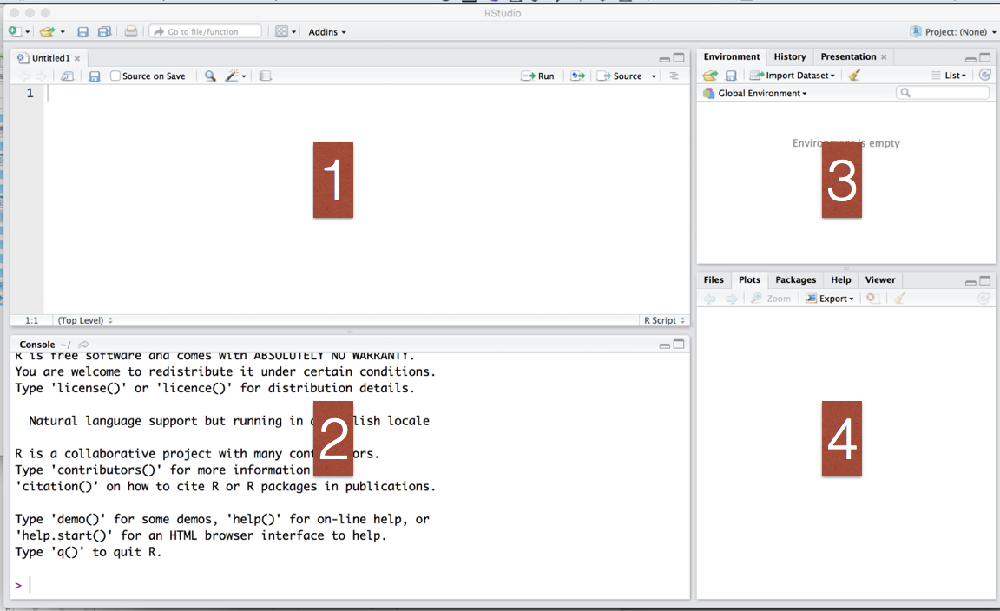

class: middle, big

# R and RStudio 

```{r setup, include=FALSE}
knitr::opts_chunk$set(echo = TRUE)
xaringanExtra::use_tile_view()
```

---

## R is ...

* One of the most popular statistical/data science programming languages

* __Free__ to use, __open source__ so you can see what code is doing to your data

* __Powerful__ for data analysis
    * With the right tools, get more work done, faster
    
* __Extensible__: More than 18000 user contributed add-on packages currently on CRAN! Bioconductor more than 2000 packages. Many researchers provide R packages through github

* __Flexible__
    * Not a question of _can_, but _how_

```{r, include=FALSE, cache=TRUE, message=FALSE}
library(XML)
library(RCurl)
url <- getURL('https://cran.r-project.org/web/packages/available_packages_by_name.html')
pkgs <- readHTMLTable(url)[[1]]
nrow(pkgs)
```

---

## RStudio is ... 

RStudio is an integrated development environment (IDE) for R.

Data scientist [Julie Lowndes](http://jules32.github.io/resources/RStudio_intro/) said:  

<!---->

<blockquote>
<p><b>If R were an airplane, RStudio would be the airport</b>, providing many, many supporting services that make it easier for you, the pilot, to take off and go to awesome places. Sure, you can fly an airplane without an airport, but having those runways and supporting infrastructure is a game-changer.</p>
</blockquote>

Rstudio is one of the best R development environment. Other good ones include [Visual Studio](https://docs.microsoft.com/en-us/visualstudio/rtvs/?view=vs-2017), [Nvim-r](https://github.com/jalvesaq/Nvim-R), and [ESS](http://ess.r-project.org/). 

---

## The RStudio IDE



---

## The RStudio IDE


1. **Source editor:** Editor for multiple file types (R, HTML, JS, etc), Useful shortcuts ("Knit"), Highlighting/Tab-completion, Code-checking, Debugging features  

2. **Console window:** Highlighting/Tab-completion, Search recent commands, and Terminal

3. **Environment pane:** Tools for package development, git, etc

4. **Other tabs/panes:** Graphics, R Help, File system navigation/access

<!--
<br>
<br>
<p class = "note">
*Protip:* save yourself the headaches figuring out file paths and instead work in an RStudio R project (popup menu at the top left)
</p>
-->
