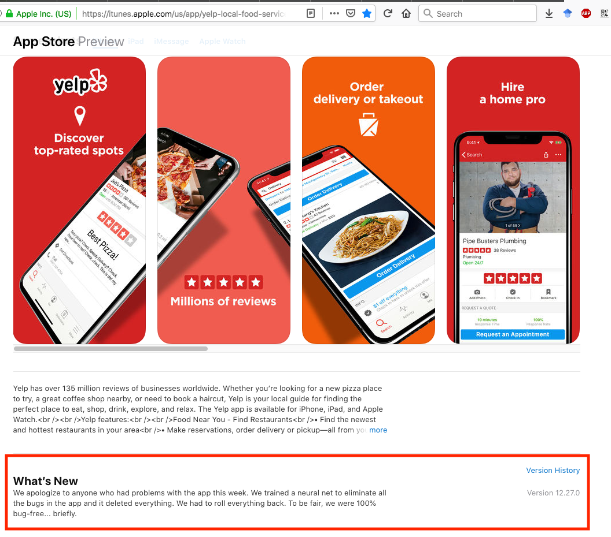
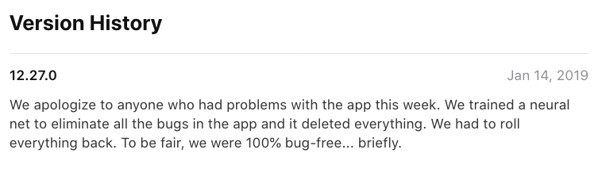

class: middle, big

```{r setup, include=FALSE}
knitr::opts_chunk$set(echo = TRUE, warning = FALSE, message = FALSE)
xaringanExtra::use_tile_view()
```

# Understanding Paths

---

## Paths

- Programs rely on specifications of  *paths* to know where to read in files and save outputs

- This is similar to an URL, but a path points to a file on your local machine

- E.g., `read.csv('input.csv')` is going to to read from file `input.csv`

- Exactly, which file in folder are we referring to?

---

## Current working directory

```{r, include=FALSE}
knitr::opts_knit$set(root.dir = '~/Downloads')
```

- Most programs have a *(current) working directory*

- It is "where you are"

- In R console, `getwd()` shows the working directory

  ```{r}
  getwd()
  ```
  
- So `read.csv('input.csv')` is going to read the file in the previous Downloads folder

- Commonly used working directory is at the source file location. To set the working directory there, in RStudio, click Session -- Set Working Directory -- To Source File Location

- You can also use `setwd()` to set the directory

---

## Absolute and Relative Paths

- An *absolute path* is the location of a file on the hard disk. An absolute path always starts with an `/`. E.g., `/` (the root folder), `/Users/xdai`, `/c/My Documents`
    - Avoid absolute path in your code because they make the code non-reproducible
    
- A *relative path* is the location of a file relative to the current working directory. E.g., 
    - `.` (current directory), 
    - `..` (parent directory), 
    - `demo.R` (`demo.R` in the current directory), and 
    - `../demo.R` (`demo.R` in the parent directory)
    
---
class: middle, big

## Bash

---

## What is `bash`

- `bash` is a text-based command-line interface to your operation system

- A tool to "talk to the system" using text-based command

- As opposed to a graphical user interface (GUI)

- bash is a very useful programming tool! Help you chain your tasks together, among other things.

- We will be accessing `git` via `bash`

---

## `bash` Command-Line

- We can access `bash` in the Terminal tab in RStudio. Homework 1 instructs you how to set this up

- The most important `bash` commands are: 
    - `pwd`, present working directory. All relative paths are relative to the present working directory.
    - `ls`, list files; `ls -a`, list all files including hidden ones
    - `cd`, change directory
    
- Other important commands: `mkdir`, `cp`, `mv`, `rm`, `open`

---

## `bash` Demonstration...

---
class: inverse

## Bash: Your Turn


2.  In RStudio, click the Terminal tab (right to the Console tab).

3.  Find the present working directory.

4.  Create a new directory named `example1`, and then `cd` into this directory. 

5.  Create an RMarkDown file named 'tmp.Rmd' in RStudio and knit it. Move it into `example1` in Bash. Also move the generated html file.

6.  Use `open` to view the content of the html file.

---

## Mess in the code

<center>

</center>

---

## Mess in the code 
**Yelp's application update:**

<center>

</center>

---

## What is Git?

- `git` is a *version control system* that is created to help developers track changes in source codes and manage collaborative projects. 

- `git` tracks the evolution of a folder containing code files and subfolders. 
<!-- The tracked folder is called a **repository** or **repo**.  -->

- `git` helps us
    - *make records* of the code files, creating snapshots
    - *compare* snapshots to locate changes or bugs
    - *rollback* to previous versions of files as necessary
    - store *master* and multiple versions of files, no more `paper_final_final_I_really_mean_it.docx`
    - *merge* versions and *resolve conflicts* that arise from collaboration

---

## Git 

Terminology from [github glossary](https://help.github.com/articles/github-glossary/)

- **Repository:** the basic element of `git` - like a project's folder. A repository contains all of the project files, and their __revision history__. 
- **Commit:** A checkpoint, i.e., snapshot of the codes files at a time point. Every time you commit, git creates a unique ID that allows you to keep record of what changes were made when and by whom.

`git` commands important to us: `git init`, `git status`, `git log`, `git add`, `git commit`, `git diff`.

Caution: `git` works well with text files but not binary files

<!-- ## Looking ahead ...  -->

<!-- In this class we will use git & github for  -->

<!-- - homework and lab assignments, and -->
<!-- - the projects. -->

---

## `git` Demonstration...

---
class: inverse

## Your turn: Making git commits

1.   Make `example1` your current directory. 

2.  Initiate the current directory as a Git repository (`git init`). What does `git status` show? 

3.  Ask Git to track the RMarkDown file and create a commit (`git add fileName`, and then `git commit -m 'Your Message Here'`).

4.  Repeat part 3 for the html file.

5.  Look at the repo status (`git status`) and repo history (`git log`) 

---


## What is GitHub?

[GitHub](github.com) is one of many hosting services, which provides additional project management functions 
<!-- (other choices are [Bitbucket](bitbucket.org), [GitLab](gitlab.com), etc.).  -->

<center>

</center>

---

## Resources

**A great tutorial written by Nick Ulle:**

- Bash & Git guide: https://github.com/2016-ucdavis-sts98/notes/blob/master/git_guide.pdf

**More extensive resources:**

- Data Carpentry's tutorials: https://software-carpentry.org/lessons/
- Scott Chacon and Ben Straub's *Pro Git*: https://git-scm.com/book/en/v2
<!-- - Reproducible Science Curriculum intitative: https://github.com/Reproducible-Science-Curriculum -->

