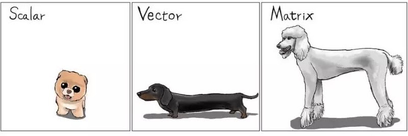

class: big, middle

```{r xaringan-tile-view, echo=FALSE}
xaringanExtra::use_tile_view()
```

## Matrix in R

---

## Outline

- What is a matrix

- Indexing

- Matrix operations and functions

---

## What is a matrix

- Matrix ia a 2-dimensional generalization of a vector

   
    
- Handy for algebraic operation, and highly efficient for numerical computation

- That said, you could form a matrix of not just numbers but also characters, and more

---

## Creating a matrix

- Create a matrix using `matrix(x, nrow=, ncol=)`. E.g., 

```{r}
matrix(1:6, 3, 2)
```

- Basically, `matrix()` wraps a long vector into the specified numbers of rows and columns

- The wrapping is along columns. In other words, an R matrix is *column-major*. So operations based on columns are slightly faster than those based on rows

- `matrix` will recycle the first input until it has `nrow * ncol` elements, following the recycling rule

---

## Combining matrices and converting matrices

- `cbind` combines two (or more) matrices by column. I.e., the matrices are put side-by-side and sticked together

- `rbind` combines two (or more) matrices by row. I.e., the matrices are vertically stacked together

- `c(A)` will flattern a matrix into a vector. `as.vector(A)` does the same

- `as.matrix` turns a vector input into a matrix with a single column, and a matrix input unchanged

---

## Indexing a matrix

Indexding a matrix is like indexing a data frame. So you can

- index by integer locations

- index using a logical vector

- index using names, if the matrix is named

```{r}
x <- matrix(1:6, 3, 2)
x
```

---

## Setting row and column names

- Setting names:
```{r}
rownames(x) <- c('orange', 'szechuan', 'brocolli')
colnames(x) <- c('chicken', 'beef')
x
```

- Indexing by names:

```{r}
x[c('orange', 'brocolli'), 'chicken']
```

- Removing names: 
  - `rownames(x) <- NULL`  
  - `colnames(x) <- NULL`

```{r, include=FALSE}
rownames(x) <- NULL
colnames(x) <- NULL
```

---

## Dropping dimensions when indexing

- A matrix is returned if there are at least two rows and columns
```{r}
x[2:3, 1:2]
```

- A vector/scalar is returned if there is only one row or one column (or both)
```{r}
x[3, 1:2]
```

---

## Dropping dimensions when indexing

- To ensure the returned value is a matrix, use the `drop=FALSE` argument when indexing. 

```{r}
x[3, 1:2, drop=FALSE]
```

- .style[When programming with matrix, pay extra attention to whether you want a matrix or a vector]

---

## Basic matrix operations

- Vector arithmatics like `+`, `-`, `*`, `/` and functions like `sqrt()`, `log()`, etc all applies to a matrix. Operations are done elementwise

- Afterall, matrix is just a wrapped vector

- Some matrix-specific operations/functions:
  - matrix multiplication: `A %*% B`. .danger[Very different from elementwise multiplication]. A review is found [here](http://linear.ups.edu/html/section-MM.html)
  - identity matrix: `diag(n)`
  - diagonal matrix: `diag(diagElements)`
  - transpose: `t(A)`
- Cont, for a square matrix
  - determinant: `det(A)`
  - inversion: `solve(A)`. Recall that $A^{-1}A = AA^{-1} = I$ where $I$ is the identity matrix
  - spectral decomposition: `eigen(A)` 
  - condition number: `kappa(A)`
  
---

## Case study: Multiple linear regression

- For the $i$th subject, the response $Y_i$ is related to $p$ predictors $X_{i1},\dots, X_{ip}$ by the linear regression model

    $$Y_i = \beta_0 + \beta_1 X_{i1} + \dots + \beta_p X_{ip} + \epsilon_i,$$

    for $i=1,\dots,n$. 

- Interpretation:

  - $\beta_0$: The intercept. Namely, the average value of the response if all predictors are set to 0 (could be unmeaningful)
  
  - $\beta_j$, for $j=1,\dots,p$: The slope. A unit increase in the $j$th predictor is associated with $\beta_j$ units of change in the response, on average, while all other predictors stay the same.
  
---

- We are given a dataset $\{(X_{i1},\dots,X_{ip}, Y_i)\}_{i=1}^n$. We want to fit the model, namely, to estimate $\beta_0, \dots, \beta_p$

- Let $\boldsymbol{\beta}=[\beta_{0}\,\beta_{1}\,\dots\beta_{p}]^{T}$, and 
$$\mathbf{X}=\left[\begin{array}{cccc}
1 & X_{11} & \dots & X_{1p}\\
1 & X_{21} & \dots & X_{2p}\\
\vdots &  &  & \vdots\\
1 & X_{n1} & \dots & X_{np}
\end{array}\right]_{n\times(p+1)},\quad\mathbf{Y}=\left[\begin{array}{c}
Y_{1}\\
Y_{2}\\
\vdots\\
Y_{n}
\end{array}\right],\quad\boldsymbol{\epsilon}=\left[\begin{array}{c}
\epsilon_{1}\\
\epsilon_{2}\\
\vdots\\
\epsilon_{n}
\end{array}\right]$$

- Then the *least squares estimation* of $\boldsymbol{\beta}$ is

$$\hat{\boldsymbol{\beta}}=[\hat{\beta_{0}}\;\hat{\beta_{1}}\;\dots\;\hat{\beta_{p}}]^{T}=(\mathbf{X}^{T}\mathbf{X})^{-1}\mathbf{X}^T\mathbf{Y}$$

- The fitted values, or our guesses of the average responses corresponding to predictors $\mathbf{X}$, are 

$$\hat{\mathbf{Y}}=\mathbf{X}\hat{\boldsymbol{\beta}} = \mathbf{X} (\mathbf{X}^{T}\mathbf{X})^{-1}\mathbf{X}^{T}\mathbf{Y}$$

---

## R demo: Implementation in R

- Data: Auto fuel efficiency dataset `mpg` in package `ggplot2`

- Question: How is the highway milage per gallon related to the model year (`year`) and engine size (`displ`)?

- Load data:

```{r}
library(ggplot2)
Y <- as.matrix(mpg$hwy)
X <- as.matrix(mpg[, c('year', 'displ')])
X <- cbind(1, X)
```

- Fit model
```{r}
betaHat <- solve(t(X) %*% X) %*% t(X) %*% Y
betaHat
```

---

- Get the fitted values

```{r}
YHat <- X %*% betaHat
head(YHat)
```

- Compare with the first few records
```{r}
head(Y)
```


---
class: inverse

## Your turn

Work on the `mpg` dataset in package `ggplot2`

 Include an additional predictor, which is the number of cylinders as a predictor. What are the new beta estimates? Note the order of the predictors

 There are two new cars for which we do not know their highway milage. These cars were both 2008 models, have displacement 2.5 and 2.0, and 6 and 4 cylinders, respectively. Predict the highway efficiency

- First create a $2 \times 4$ design matrix $X_0$, for which the columns contain the intercept (just 1), year, displacement, and the number of cylinders
- Obtain the prediction $\hat{Y}_0 = X_0\hat{\boldsymbol{\beta}}$
