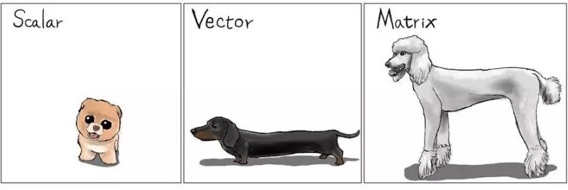

class: big, middle

```{r xaringan-tile-view, echo=FALSE}
xaringanExtra::use_tile_view()
```

## Matrix in R

---

## Outline

- What is a matrix

- Indexing

- Matrix functions and operations

- Case study

---

## What is a matrix

- Matrix ia a 2-dimensional generalization of a vector

   
    
- Handy for algebraic operation

- Highly efficient for numerical computation

- That said, you could form a matrix of not just numbers but also characters, and more

---

## Creating a matrix

- Basically, a matrix is just a long vector wrapped into some specified numbers of rows and columns

- Create a matrix using `matrix(x, nrow=, ncol=)`. E.g., 
    ```{r}
    matrix(1:6, 3, 2)
    ```


- The wrapping is along columns. In other words, an R matrix is *column-major*. 
Operations based on columns are slightly faster than those based on rows

- `matrix` will recycle the first input until it has `nrow * ncol` elements, following the recycling rule

- `matrix(..., byrow=TRUE)` will create the matrix by row (wrap the vector along the rows)

---

## Combining matrices and converting matrices

- `cbind` combines two (or more) matrices by column. I.e., the matrices are put side-by-side and sticked together

- `rbind` combines two (or more) matrices by row. I.e., the matrices are vertically stacked together

- `c(A)` will flattern a matrix into a vector. `as.vector(A)` does the same

- `as.matrix` turns a vector input into a matrix with a single column, and a matrix input unchanged

---

## R demo

---
class: inverse

## Your turn

 Create a matrix
$$\left(\begin{array}{ccc}
5 & 7 & 9 \\
6 & 8 & 10
\end{array}\right)$$
and name it `y`

 Create matrix 
$$\left(\begin{array}{ccc}
5 & 7 & 9 \\
6 & 8 & 10\\
1 & 2 & 3
\end{array}\right)$$
by combining the previous result with a new row. Name the new matrix `y1`

 Flattern `y1` into a vector

---

## Indexing a matrix

Indexding a matrix is like indexing a data frame. So you can

- index by integer locations. E.g.,
    ```{r}
    z <- matrix(1:9, 3, 3)
    z[1:2, -3]
    ```

- index using a logical vector. E.g.,
    ```{r}
    z[c(TRUE, FALSE, TRUE), ]
    ```
    
- index using names, if the matrix is named

---

## Setting row and column names

- Setting names:
    ```{r}
    rownames(z) <- c('orange', 'szechuan', 'brocolli')
    colnames(z) <- c('chicken', 'beef', 'pork')
    z
    ```

- Indexing by names:
    ```{r}
    z[c('orange', 'brocolli'), 'chicken']
    ```

- Removing names: 
  - `rownames(z) <- NULL`  
  - `colnames(z) <- NULL`

    ```{r, include=FALSE}
    rownames(z) <- NULL
    colnames(z) <- NULL
    ```

---

## Dropping dimensions when indexing

- A matrix is returned if there are at least two rows *and* columns
    ```{r}
    z[2:3, ]
    ```

- A vector/scalar is returned if there is only one row *or* one column (or both)
    ```{r}
    z[3, ]
    ```

---

## Dropping dimensions when indexing

- To ensure the returned value is a matrix, use the `drop=FALSE` argument when indexing. 
    ```{r}
    z[3, , drop=FALSE]
    ```

- .style[When programming with matrix, pay extra attention to whether you want a matrix or a vector]

---

## R demo

---

## Basic matrix functions

- `dim(A)`, `nrow(A)`, `ncol(A)`, the dimensions, number of rows, and number of columns of a matrix

- `t(A)`, matrix transpose

- Working with diagonal matrices: `diag` is used to extract the diagonal elements of a matrix or to create a diagonal matrix
  - extract diagonal: `diag(A)`
  - identity matrix: `diag(1, n)`
  - diagonal matrix: `diag(diagVec, length(diagVec))`
  
- `rowMeans`, `rowSums`, `colMeans`, `colSums`: Find the means or the sums over the rows or the columns, as the function names suggest

---

## Matrix operations

- Vector arithmatics like `+`, `-`, `*`, `/` and functions like `sqrt()`, `log()`, etc all applies to a matrix

  - Afterall, matrix is just a wrapped vector
  
  - Operations are done elementwise
  
  - Operations follow the recycling rule

---

- Matrix multiplication: `A %*% B`

  - A review is found [here](https://www.mathbootcamps.com/multiplying-matrices/)
  
  - This is .danger[very different from elementwise multiplication]
  
  - By default, $AB$ means the matrix multiplication for two matrices $A$ and $B$, not the elementwise product
  
  - In order for $AB$ to be defined, we must have $A_{n \times p}$ and $B_{p \times m}$, namely, the inner dimensions of the two matrices must match. The result $AB$ will be $n\times m$

---

- Some operations/functions for a square matrix

  - inversion: `solve(A)` calculates the inverse $A^{-1}$ of a square matrix $A$. This is .danger[Very different from elementwise reciprocal]
    
  - Recall that $A^{-1}A = AA^{-1} = I$ where $I$ is the identity matrix

  - (Optional) determinant: `det(A)`
  
  - (Optional) spectral decomposition: `eigen(A)` 
  
  - (Optional) condition number: `kappa(A)`. A very large condition number means the inversion of that matrix is prone to error
  
  
---
## R demo

---
class: inverse

## Your turn


 Create a $3\times 3$ diagonal matrix with diagonal elements being 2, 4, and 6

</br>For the next two questions, start with `A <- matrix(5:10, 2, 3)`

 Find $2A$, i.e., the matrix consisting of 2 times the entries of $A$

 Find the matrix product $AA^T$, where $A^T$ denotes the transpose of $A$


---
class: big, middle

## Case study

---

## Case study: Multiple linear regression

- For the $i$th subject, the response $Y_i$ is related to $p$ predictors $X_{i1},\dots, X_{ip}$ by the linear regression model

    $$Y_i = \beta_0 + \beta_1 X_{i1} + \dots + \beta_p X_{ip} + \epsilon_i,$$

    for $i=1,\dots,n$. 

- Interpretation:

  - $\beta_0$: The intercept. Namely, the average value of the response if all predictors are set to 0 (could be unmeaningful)
  
  - $\beta_j$, for $j=1,\dots,p$: The slope. A unit increase in the $j$th predictor is associated with $\beta_j$ units of change in the response, on average, while all other predictors stay the same.
  
---

- We are given a dataset $\{(X_{i1},\dots,X_{ip}, Y_i)\}_{i=1}^n$. We want to fit the model, namely, to estimate $\beta_0, \dots, \beta_p$

- Let $\boldsymbol{\beta}=[\beta_{0}\,\beta_{1}\,\dots\beta_{p}]^{T}$, and 
$$\mathbf{X}=\left[\begin{array}{cccc}
1 & X_{11} & \dots & X_{1p}\\
1 & X_{21} & \dots & X_{2p}\\
\vdots &  &  & \vdots\\
1 & X_{n1} & \dots & X_{np}
\end{array}\right]_{n\times(p+1)},\quad\mathbf{Y}=\left[\begin{array}{c}
Y_{1}\\
Y_{2}\\
\vdots\\
Y_{n}
\end{array}\right],\quad\boldsymbol{\epsilon}=\left[\begin{array}{c}
\epsilon_{1}\\
\epsilon_{2}\\
\vdots\\
\epsilon_{n}
\end{array}\right]$$

- Then the *least squares estimation* of $\boldsymbol{\beta}$ is

$$\hat{\boldsymbol{\beta}}=[\hat{\beta_{0}}\;\hat{\beta_{1}}\;\dots\;\hat{\beta_{p}}]^{T}=(\mathbf{X}^{T}\mathbf{X})^{-1}\mathbf{X}^T\mathbf{Y}$$

---

- For a record with covariates $\mathbf{x}_0 = [1\; x_{01}\; \dots\; x_{0p}]$, the predicted average response is 

$$\hat{Y}_0 = \mathbf{x}_0 \hat{\boldsymbol{\beta}} = \mathbf{x}_0 (\mathbf{X}^{T}\mathbf{X})^{-1}\mathbf{X}^{T}\mathbf{Y}$$

- The fitted values, or our guesses of the average responses corresponding to the original predictors $\mathbf{X}$, are 

$$\hat{\mathbf{Y}}=\mathbf{X}\hat{\boldsymbol{\beta}} = \mathbf{X} (\mathbf{X}^{T}\mathbf{X})^{-1}\mathbf{X}^{T}\mathbf{Y}$$

---

## R demo: Implementation in R

- Data: Auto fuel efficiency dataset `mpg` in package `ggplot2`

- Question: How is the highway milage per gallon (`hwy`) related to the model year (`year`) and engine size (`displ`)?

- Load data:

```{r}
library(ggplot2)
Y <- as.matrix(mpg$hwy)
X <- as.matrix(mpg[, c('year', 'displ')])
X <- cbind(1, X)
```

- Fit model
```{r}
betaHat <- solve(t(X) %*% X) %*% t(X) %*% Y
betaHat
```

---

- Get the fitted values

```{r}
YHat <- X %*% betaHat
head(YHat)
```

- Compare with the first few records
```{r}
head(Y)
```


---
class: inverse

## Your turn

Work on the `mpg` dataset in package `ggplot2`

 Include an additional predictor, which is the number of cylinders as a predictor. What are the new beta estimates? Note the order of the predictors

 There is a new car for which we do not know its highway milage. The car was a 2008 model, had displacement 2.5, and 6 cylinders. Predict the highway efficiency

- First create a $1 \times 4$ design matrix $\mathbf{x}_0$, for which the columns contain the intercept (just 1), year, displacement, and the number of cylinders
- Obtain the prediction $\hat{Y}_0 = x_0\hat{\boldsymbol{\beta}}$ 
