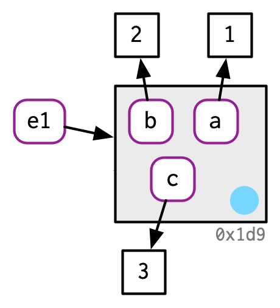
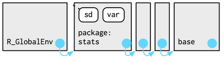
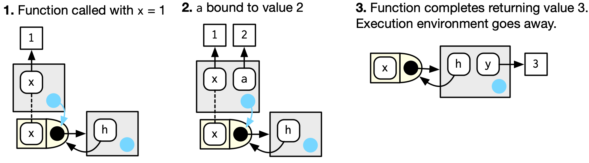

```{r xaringan-tile-view, echo=FALSE}
xaringanExtra::use_tile_view()
```

## Outline

- Lexical scoping

- Environments

- Lazy evaluation


---
class: big, middle

## How does R find variables in functions?

---

## How does R find variables in functions?

Use your intuition to predict what the following functions output:

1. 
    ```{r, eval=FALSE}
    x <- 1
    f1 <- function() {
      x <- 2
      print(x)
    }
    f1()
    ```

2. 
    ```{r, eval=FALSE}
    f2 <- function() {
      if (!exists("a")) {
        a <- 1
      } else {
        a <- a + 1
      }
      a
    }
    f2()
    f2()
    ```

---

3\. 

```{r, eval=FALSE}
power <- 2
map_dbl(1:3, function(x) x ^ power)
```
    
4\. 
```{r, eval=FALSE}
times <- 1
f3 <- function() rep(0, times)
g <- function() {
  times <- 2
  f3()
}
g()
```

At the end of the class, you will understand why the functions behave as such, and also understand more rules for how R find things (and thus you can program better).

---
class: big, middle

## How does R know *where* to find variables?

---

## Lexical scoping

- R follows *lexical scoping*, namely *where* it looks up values of variable names based on how a function is defined, not how it is called

- This means that, where the code find the names it needs is decided by the author of the code. The user can modify the behavior of the code only through changing the input, not through changing the environment where the function is called

- This makes R code easier to reason with 

- (This is as opposed to *dynamic scoping*, which look up values based on how a function is called)

- We will learn four principles for lexical scoping
    1. Masking
    1. Functions are variables
    1. Fresh starts
    1. Dynamic lookup

---

## Four rules for lexical scoping

1. *Masking*: Variables defined inside a function mask variables defined outside a function
    ```{r, eval=TRUE}
    x <- 1
    f1 <- function() {
      x <- 2
      print(x)
    }
    f1()
    ```

---

1. *Masking cont*: If a variable isn’t defined inside a function, R looks one level up *where the function is defined*
    ```{r, eval=TRUE}
    x <- 1
    f1_1 <- function() {
      print(x)
    }
    f1_1()
    ```
    
    ... *not where the function is called*
    ```{r, eval=TRUE}
    times <- 1
    f3 <- function() rep(0, times)
    g <- function() {
      times <- 2
      f3()
    }
    g()
    ```
---

1. *Masking cont*: The masking rule applies the same if a function is defined inside another function

```{r}
x <- 0
f1_2 <- function() {
  x <- 1
  g <- function() {
    y <- 2
    c(x, y)
  }
  g()
}
f1_2()
```
---

2\. *Functions are ordinary variables*, so the scoping rules apply when looking up both functions and variables

```{r}
g <- sum
f2_1 <- function() {
  g <- mean
  g(1:2)
}
f2_1()
```

---

3\. *Fresh starts*: The excution of a function is not affected by the previous excutions
```{r}
f2 <- function() {
  if (!exists("a")) {
    a <- 1
  } else {
    a <- a + 1
  }
  a
}
f2()
f2()
```

---

4\. *Dynamic lookup*. R looks up the values when the function is run, not when the function is created (Lexical scoping determines *where*, but not *when* to look for values.)

```{r}
x <- 1
f_4 <- function() x
x <- 2
f_4()
```

---
class: big, middle

## Mechanism for the scoping rules: Environments

---

## Binding values

- All R objects are pieces floating in your computer memory

- When you create `x <- c(1, 2, 3)`, 
    - R allocates a piece of memory to store the values `c(1, 2, 3)`
    - R *binds* the variable name (symbol) `x` to that value
    - The same value may have multiple bindings

.center[

</br>Figures are due to [Hadley Wickham](https://adv-r.hadley.nz/)
]

- Similarly, a data frame `d1 <- data.frame(x = c(1, 5, 6), y = c(2, 4, 3))` behaves like 
.center[

]

---

## Environment

An environment is a container of variables (which can itself be a variable like `e1`)

.center[

]

---

## The global environment

- The *global environment* is where the R console evaluates your expressions

- It is sometimes called the "workspace"

- Type `ls()` in the R console to see the variables in the global environment

- You can also use the RStudio Environment browser tab

---

## Parent environment

- Each environment has a *parent*, which is another environment (except for a special empty environment which does not have a parent)

- The parent of the global environment is a package environment containing the functions offered by the package

- When looking up a variable/function, R is going to look up the chain of parent environments until it finds the first match

- The following figure explains how does R find the `sd` function when you type it in the console, which does not exist in the global environment

.center[

]

- The order of the attached packages (environments) is also known as the *search path*. See `search()`

---

## The function environment

The environment of a function, called the *function environment*, is the environment where the function is created. E.g., for 

```
y <- 1
f <- function(x) x + y
```

.center[

]

---

- So, in reality, a function has three parts, the arguments, the code inside the function, and the *function environment* which determines where to find the variables it uses

- You may see functions are called closures. This name reflects the fact that a function enclose its environment
    ```{r}
    typeof(mean)
    ```

---

## The excecution environment

- Every time a function is called, a freshly created environment called the *execution environment* will be created
- The body of the function will be evaluated in the encapsulated execution environment
- The parent of the execution environment is the function environment
- The execution environment goes away, most of the times, after the function returns

```{r}
h <- function(x) { # 1.
  a <- 2 # 2.
  x + a
}
y <- h(1) # 3.
```
.center[

]

---

## A more complex example

A function that returns a function (function factory)
```{r, collapse=TRUE}
plus <- function(x) {
  function(y) x + y
}

plus_one <- plus(1)
```

.center[

]

- The function environment of `plus_one` is the execution environment of `plus(1)`
---

## A more complex example cont.

```{r, collapse=TRUE}
plus_one
plus_one(2)
```

.center[

]

- When `plus_one` is executed, the execution environment has a parent function environment that contains `x`

---
class: big, middle

## Lazy evaluation

---
## Lazy evaluation
R function arguments are lazily evaluated. There are three principles:

1. Function arguments are held as an unevaluated *expression* (a.k.a., a *promise*). They are evaluated only if accessed

    E.g., `stop(message)` will produce an error
    ```{r, error=TRUE}
    stop("an error here")
    ```

    But you will not have an error running the following because the argument `x` is not used in `h()`
    ```{r, error=TRUE}
    h <- function(x) {
      10
    }
    h(stop("an error here"))
    ```

---

2\. The evaluation is done only once when the value is accessed, and then it is cached (remembered). So `double(20)` in the following example is evaluated only once

```{r}
double <- function(x) { 
  message("Calculating...")
  x * 2
}

h2 <- function(x) {
  c(x, x)
}

h2(double(20))
```

---

3\. The evaluation is evaluated in the environment where the expression is defined

```{r}
tripple <- function(x)  x * 3
h3 <- function(x) {
  y <- 100
  x
}

y <- 1
h3(tripple(y))
```

---

## Some implications of lazy evaluation

Lazy evaluation is useful for the following tasks:

1. Specifying default arguments for a function

1. Non-standard evaluation

---

## Default arguments

- The default argument of a function can depend on another argument. E.g., see `?seq`

    A simplified e.g.
    ```{r}
    h4 <- function(x = 2 * y, y) {
      c(x, y)
    }
    h4(y=1)
    ```
    
    We do not have an error because `x = 2 * y` is no evaluated at the beginning of the function, but only evaluated at `c(x, y)`

---

- An empty argument can have a default as well

```{r}
h5 <- function(x) {
  if (missing(x)) {
    x <- "my default"
  }
  x
}
h5()
```

---

## Non-standard evaluation

*Non-standard evaluation* (NSE) is as opposed to standard evaluation rules which interpret arguments by the values

E.g. of NSE:

- `library` is NSE in its first argument
    ```{r, error=TRUE}
    library(MASS) # OK
    x <- "MASS"
    library(x) 
    ```

---

- `plot` is NSE in the `x` and `y` arguments
    ```{r, fig.height=5, fig.width=5}
    myX <- 1:10
    plot(myX, sin(myX)) # How does plot() set the label names?
    ```

- You will see more NSE examples (some super useful) when we introduce `dplyr`

---

## References

- Chapters 2, 6, 7, and 10, [Advanced R](https://adv-r.hadley.nz/index.html) by Hadley Wickham
