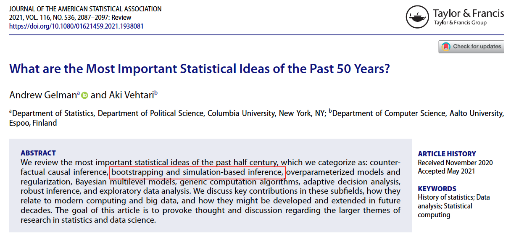

```{r xaringan-tile-view, echo=FALSE}
xaringanExtra::use_tile_view()
knitr::opts_chunk$set(fig.height=4, fig.width=4, fig.align='center')
```

## Outline

- The bootstrap

- Bootstrap confidence intervals

---

.center[

]

---

## The bootstrap

- The bootstrap is a general method to assess uncertainties in estimation problems
  
- We will be using the bootstrap for two tasks: (1) to estimate standard errors and (2) to construct confidence intervals

- The boostrap makes use of *simulation* rather than *mathematical derivation* to derive inference
  
- It falls in the class of *resampling methods*, because you will be resampling the original data

- It does not assume a form for the underlying distribution. So bootstrap is a *nonparametric* method

- The boostrap is a computationally heavy method, which is made possible due to the general access to greater computational power


---

## An introductory task

Suppose that we have i.i.d. observations $X_1,\dots,X_n$ from a distribution with an unknown cdf $F$. Let $T_n = g(X_1,\dots, X_n)$ be a statistic. 

- *For now, consider $T_n$ being the sample median*, which is used to estimate the population median.

- Task: We want to estimate the standard error $\text{var}(T_n)$ 

- We don't know a formula for the variance $\text{var}(T_n)$ of a sample median (unlike if $T_n$ was the sample mean)

---

## The sampling distribution

<!-- The distribution of the statistic $T_n$ is called the *sampling distribution*.  -->

<!-- - The randomness of $T_n$ comes from the randomness in the sampling process (you could have had a different sample). -->

If we were able sample from the distribution of $X_i$, then we could solve the problem using simulation!

1. Draw a sample $\{X_i\}_{i=1}^n$

1. Calculate a value $T_n$

1. Repeat a lot of times

1. Pooling all the realizations of $T_n$ together. You have a sample of $T_n$ from the sampling distribution of $T_n$

1. Estimate the standard error using the standard deviation of the sample of $T_n$

<!-- - If we can sample from the distribution of $X_i$, say if we knew $X_i \sim \exp(\lambda=1)$, then we can then use simulation to obtain the sampling distribution, and estimate the standard error. -->
---

E.g., suppose that we knew $X_i \sim \exp(\lambda=1)$, 
```{r, fig.height=3, fig.width=6, collapse=TRUE}
library(purrr)
set.seed(1)
n <- 100
B <- 1000 # repeats
getTn <- function(i) {
  X <- rexp(n)
  median(X)
}
Tn <- map_dbl(seq_len(B), getTn)
hist(Tn) # A nice, normal-like distribution
sd(Tn)
```

---

## Monte Carlo integration

Here is some rigorous justification for what we did. Let $G$ be the sampling distribution of $T_n$, and $Y_1,\dots, Y_B$ be i.i.d. realizations from $G$ (coming from $B$ Monte Carlo repeats).

- By the law of large numbers, 
$$\frac{1}{n} \sum_{j=1}^n Y_j \overset{P}{\rightarrow} E(Y_1) = \int x dG(x).$$

- More generally, for any function $h: \mathbb{R} \rightarrow \mathbb{R}$,
$$\frac{1}{n} \sum_{j=1}^n h(Y_j) \overset{P}{\rightarrow} E(h(Y_1)) = \int h(x) dG(x).$$

- In general, the sample average of the simulated test statistics estimates the true mean/integral. This is called the *Monte Carlo integration*

- So the standard deviation of $Y_1,\dots, Y_B$ approximates the standard error of $T_n$

---

## Back to the introductory task

- But in real life we do not know the underlying distribution $F$ of $X_i$ and cannot sample from it. We just have the data $\{X_1,\dots, X_n\}$

- The idea of bootstrap is that we use the empirical distribution $F_n$ of $\{X_1,\dots,X_n\}$ to approximate $F$

    - Recall that the empirical distribution $F_n$ is the distribution that puts the same mass on each of the data points

- Namely, each time obtain a *bootstrap sample* $\{X_1^*,\dots,X_n^*\}$ of size $n$ where $X_i^*$ is sampled *with replacement* from $\{X_1,\dots,X_n\}$

- Then calculate $T_n^*$ from $\{X_1^*,\dots,X_n^*\}$

- Repeat for a large $B$ number of times. Usually, $B=500$ or $1000$ if not more

||Distribution| Sample | Estimate|
|---|---|---|---|
|Real world | $F$ | $X_1,\dots,X_n$ | $T_n=g(X_1,\dots,X_n)$|
|Bootstrap world | $F_n$ | $X_1^*,\dots,X_n^*$ | $T_n^* = g(X_1^*,\dots,X_n^*)$

---
Example. Our dataset $X_1,\dots, X_{32}$ contains the 1/4 mile time of randomly selected cars
```{r, collapse=TRUE}
(X <- mtcars$qsec)
```

The bootstrap standard error estimate of the sample median is
```{r}
n <- length(X)
B <- 2000
Tnstar <- map_dbl(seq_len(B), function(i) {
  Xstar <- sample(X, n, replace=TRUE)
  median(Xstar)
})
sqrt(mean((Tnstar - mean(Tnstar))^2)) # sd(Tnstar)
```

---

## Summary for bootstrap s.e. estimate

Setting: Given i.i.d. data $X_1,\dots,X_n$, estimate the standard error of a (general) test statistic $T_n = g(X_1,\dots, X_n)$
- $T_n$ can be any statistic, e.g., sample median, sd, kurtosis
- Each $X_i$ can be paired or multivariate. So $T_n$ can be correlation etc

The bootstrap procedure:
1. Draw $\{X_1^*,\dots,X_n^*\}$ from $\{X_1,\dots,X_n\}$ *with replacement*
1. Compute $T_n^* = g(X_1^*,\dots,X_n^*)$
1. Repeat the previous steps $B$ times and obtain *bootstrap estimates* $T_{n1}^*,\dots,T_{nB}^*$. The distribution of $T_{n1}^*$ is the *bootstrap distribution*
1. The bootstrap s.e. estimate is 
$$s_{\text{boot}} = \sqrt{\frac{1}{B}\sum_{b=1}^B\left( T_{n,b}^* - \bar{T}_n^* \right)^2},$$
where $\bar{T}_n^* = \frac{1}{B}\sum_{j=1}^B T_{nj}^*$

---

class: inverse

## Your turn

Go back to the 1/4-mile time example. Start with `X <- mtcars$qsec`. 


 Use the bootstrap to obtain an estimate of the standard erorr of the sample mean $T_n = n^{-1}\sum_{i=1}^n X_i$

 Compare the bootstrap standard error estimate with the standard error estimate for the sample mean that you learned from an earlier statistics class

---

## Bootstrap confidence intervals

Let $\theta$ be a parameter of interest, and $\hat\theta_n = T_n = g(X_1,\dots,X_n)$ be an estimate targeting $\theta$. 

- There are many ways to construct bootstrap confidence intervals

- All are valid and should be similar if the sample size is large, but there may be a practical difference if the sample size is small

- We will cover three methods, so you will not be unfamiliar the next time you see such as c.i.

  1. The normal interval
  
  1. A pivotal interval
  
  1. A percentile interval


---

## The normal bootstrap c.i.

The $1-\alpha$ *normal boostrap c.i.* is simply
$$\hat\theta_n \pm z_{\alpha/2} s_\text{boot},$$
where $z_{\alpha/2}$ is the upper $\alpha/2$ quantile of $N(0,1)$, and $s_\text{boot}$ is the bootstrap s.e. estimate for $\hat\theta_n$

- Advantage: Simplicity

- Disadvantage: The interval requires the sampling distribution of $\hat\theta_n$ to be close to normal. If this is not true, the normal c.i. will have a larger coverage error
  
- Fortunately, most of the time the distribution of $\hat\theta_n$ is approximately normal when the sample size is large, e.g. for the sample median

- More on when the bootstrap fails later

---

## The pivotal method

Let $\theta_\alpha^*$ be the $\alpha$-quantile of the bootstrap estimates $\{\theta_{n1}^*,\dots,\theta_{nB}^*\}$. 
The $(1-\alpha)\times 100\%$ *pivotal bootstrap c.i.* is
$$(2\hat\theta_n - \theta_{1-\alpha/2}^*,\, 2\hat\theta_n - \theta_{\alpha/2}^*)$$

- Advantage: The pivotal method could be more accurate than the normal method because of a better approximation to the sampling distribution of $\hat\theta_n$

---

## Why "pivotal"? Why it works?

Let $R_n = \hat\theta_n - \theta$. It is called a *pivot* because it involves both $\hat\theta_n$ and $\theta$. If we knew the distribution function $H$ of $R_n$, we would construct c.i.
$$(\hat\theta_n - H^{-1}(1-\frac{\alpha}{2}),\, \hat\theta_n - H^{-1}(\frac{\alpha}{2})).$$
This c.i. will cover $\theta$ with probability exactly $1-\alpha$.

But since we don't know $H$, we need to approximate it using the bootstrap.
Let $R_{nb}^* = \hat\theta_{nb}^* - \hat\theta_n$ be the bootstrap version of the pivot. 
We do not know the distribution of $R_{nb}^*$ either, but we can generate many bootstrap estimates and use the empirical distribution of $(R_{n1}^*,\dots,R_{nB}^*)$ to approximate the former (very closely).

Let $q^*_\alpha$ be the $\alpha$-quantile of $(R_{n1}^*,\dots,R_{nB}^*)$. The bootstrap pivotal c.i. is
$$(\hat\theta_n - q_{1-\alpha/2}^*,\, \hat\theta_n - q_{\alpha/2}^*) = (2\hat\theta_n - \hat\theta_{1-\alpha/2}^*,\, 2\hat\theta_n - \hat\theta_{\alpha/2}^*).$$ 


---

## The percentile method

The $1-\alpha$ *bootstrap percentile c.i.* is 
$$(\theta_{\alpha/2}^*, \theta_{1-\alpha/2}^*).$$

- Recall that $\theta_\alpha^*$ is the $\alpha$-sample quantile of the bootstrap estimates $\{\theta_{n1}^*,\dots,\theta_{nB}^*\}$

- Advantage: Simplicity

- Disadvantage: The coverage error is often substantial if the distribution of $\hat\theta_n$ is not symmetric

---

## When the bootstrap works and fails

The bootstrap requires the observations to be i.i.d. The data can follow any distribution.

The bootstrap may not work well if:

- the sample size is too small

- there are outliers

The bootstrap does not work if:

- the test statistic involve the extremes $\max(X_i)$ or $\min(X_i)$

- $X_1,\dots,X_n$ are dependent. E.g., if they come from a time series

---

## Eg: Bootstrap ci for a paired sample

We will use the boostrap to construct c.i.s for $\text{cor}(X,Y)$.
The data are the LSAT scores (for entrance to law school) and GPA. 
We are interested in seeing whether the entrance score is correlated to GPA.
Note that the sample size $n=15$ is quite small, so the bootstrap results should be interpreted with some skepticism.
```{r}
lsat <- c(576,  635,  558,  578,  666,  580,  555,  661,  651,  605,  653,  575,  545,  572,  594)
gpa  <- c(3.39, 3.30, 2.81, 3.03, 3.44, 3.07, 3.00, 3.43, 3.36, 3.13, 3.12, 2.74, 2.76, 2.88, 2.96)
```

Obtain bootstrap estimates and s.e.
```{r, collapse=TRUE}
n <- length(lsat)
B <- 1000
alpha <- 0.05
thetan <- cor(lsat, gpa)
thetaStar <- map_dbl(seq_len(B), function(i) {
  index <- sample(n, replace=TRUE)  
  xStar <- lsat[index]
  yStar <- gpa[index]
  cor(xStar, yStar)
})
(sboot <- sd(thetaStar))
```

---

Construct the three bootstrap c.i.s
```{r, collapse=TRUE}
# Normal method
zz <- qnorm(alpha / 2, lower.tail = FALSE)
(normal <- c(thetan - zz * sboot, thetan + zz * sboot))
```
```{r, collapse=TRUE}
# Pivotal method
thetaStarQ <- unname(quantile(thetaStar, c(alpha / 2, 1 - alpha / 2)))
(pivotal <- c(2 * thetan - thetaStarQ[2], 2 * thetan - thetaStarQ[1]))
```
```{r, collapse=TRUE}
# Percentile method
(percentile <- thetaStarQ)
```
Since correlation coefficient must lie in $[-1, 1]$, trim the c.i.s
```{r,collapse=TRUE}
trimCor <- function(rho) pmin(pmax(rho, -1), 1)
trimCor(normal)
trimCor(pivotal)
trimCor(percentile)
```


---
## Example: Bootstrapping two samples

We will use the boostrap to calculate the standard error for $\bar{X} - \bar{Y}$.
Let $X_1,\dots,X_n$ be the sepal lengths of iris setosa, and $Y_1,\dots, Y_m$ be those for the iris versicolor.
```{r}
X <- iris$Sepal.Length[iris$Species == "setosa"]
Y <- iris$Sepal.Length[iris$Species == "versicolor"]
```

Obtain bootstrap estimates and s.e.
```{r, collapse=TRUE}
B <- 1000
n <- length(X)
m <- length(Y)
TnFunc <- function(X, Y) mean(X) - mean(Y)
Tn <- TnFunc(X, Y)
Tnstar <- map_dbl(seq_len(B), function(i) {
  Xstar <- sample(X, n, replace = TRUE)
  Ystar <- sample(Y, m, replace = TRUE)
  TnFunc(Xstar, Ystar)
})
(sboot <- sd(Tnstar))
```
---

## Summary: Bootstrapping two samples

Setting: We are given two independent samples $X_1,\dots,X_n$ and $Y_1,\dots, Y_m$. 
We are interested in a test statistic $T_n = g(X_1,\dots, X_n, Y_1,\dots, Y_m)$ (e.g., the difference $\bar{X} - \bar{Y}$ between the two sample means)

The bootstrap procedure:
1. Draw $\{X_1^*,\dots,X_n^*\}$ from $\{X_1,\dots,X_n\}$ and draw $\{Y_1^*,\dots,Y_m^*\}$ from $\{Y_1,\dots,Y_m\}$, both *with replacement*
1. Compute $T_n^* = g(X_1^*,\dots,X_n^*, Y_1^*, \dots, Y_m^*)$
1. Repeat the previous steps $B$ times and obtain *bootstrap estimates* $T_{n1}^*,\dots,T_{nB}^*$. The distribution of $T_{n1}^*$ is the *bootstrap distribution*
1. The bootstrap s.e. estimate is 
$$s_{\text{boot}} = \sqrt{\frac{1}{B}\sum_{b=1}^B\left( T_{n,b}^* - \bar{T}_n^* \right)^2},$$
where $\bar{T}_n^* = \frac{1}{B}\sum_{j=1}^B T_{nj}^*$. The boostrap c.i.s also have the same form as in the one-sample case

