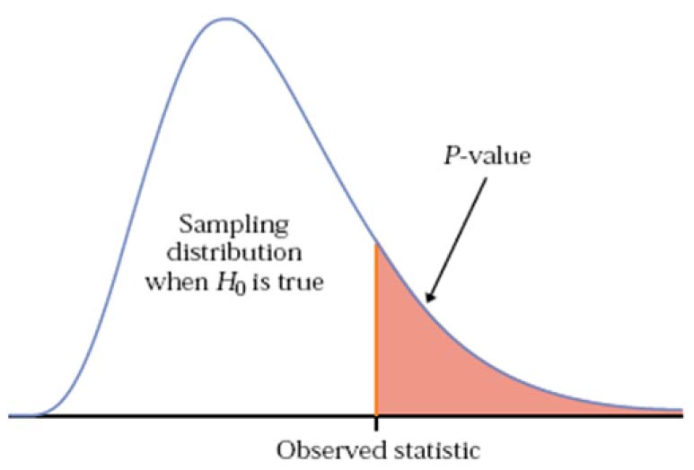

class: big, middle

```{r xaringan-tile-view, echo=FALSE}
xaringanExtra::use_tile_view()
knitr::opts_chunk$set(fig.height=4, fig.width=4, fig.align='center')
```

## Permutation Tests

---

## Outline

- Sampling distribution

- The bootstrap

- Bootstrap confidence intervals

---

## Permutation tests

- Permutation tests are a class of *nonparametric* hypothesis tests

- They do not require knowledge about the form of the underlying distribution

- Again, permutation tests rely on resampling the data. More precisely, permutating the observations

---
class: big, middle

## Two-sample test

---

## A first task: Two-sample test
We have the survival times for two groups of mice: `x` for 7 mice in the treatment group and `y` for 8 mice in the control group. We would like to tell whether the treatment affects survival time.
```{r}
x <- c(94, 197, 16, 38, 99, 144, 23)
y <- c(52, 104, 146, 10, 51, 30, 40, 27, 46)
```
```{r, echo=FALSE, fig.width=8}
par(mfrow=c(1, 2))
hist(x)
hist(y)
par(mfrow=c(1, 1))
```

It is hard to tell whether the distributions may be normal, so applying a $t$-test is questionable.

---

Instead, we test 
$$H_0: F_X = F_Y \quad \text{vs}\quad H_A: F_X \ne F_Y,$$
where $F_X$ and $F_Y$ are the distribution in the treamtent and the control group, resp.
Perform the following thought experiment:

- If the treatment is effectless $(H_0)$, then all mice are equivalent, and their id and groups are superficial (just labels)

- In this case, the label is arbitrary. Although in the real world, the first mouse has value 94, we could as well label any other mouse as "the first mouse". So any value in `x` and `y` are as likely to be the survival time for the first mouse

- This means any random selection of 7 values from the combined data is an equal likely choice for the values in the control group

- In summary, under $H_0$, the dataset we observe is just one possibility out of many equally likely ones obtained by shuffling the labels for the mice

- Thus, *if we randomly permute the pooled values, we are effectively doing a simulation where data come from $H_0$*

---

## Obtaining $p$-value

- Recall that the p-value is the probability for the test statistic $T_0$ to be more or equally extreme than the observed value under $H_0$

.center[

]

- We don't know what is the sampling distribution, so we use simulation to approximate it

- More precisely, we permute the labels of the observations. A realization $T_\text{perm}$ of the test statistic $T_0$ is obtained from a permutation. 

- The distribution of $T_\text{perm}$ is called the *permutation distribution*. It is used in place of the sampling distribution

---

## The permutation distribution

To make idea precise, here is a toy two-sample test example. Sample 1 is $(X_1,X_2) = (1,3)$ and Sample 2 is $Y_1 = 9$. The permutated observations for $(X_1, X_2, Y_1)$ are:

|Permutation | $T_\text{perm}$ | Probability |
|:-----:|:------:|:------:|
|(1,9,3)|2|1/6|
|(9,1,3)|2|1/6|
|(1,3,9)|7|1/6|
|(3,1,9)|7|1/6|
|(3,9,1)|5|1/6|
|(9,3,1)|5|1/6|

The observed value is (1,9,3), so the observed test statistic is $t_0=7$. The p-value is 
$$P(T_\text{perm} \ge t_0) = 2/6.$$

---

## Approximating the permutation distribution

|Sample sizes | # of permutations |
|:-----:|:------:|
| $n_1 = 2$, $n_2=1$ | 3 |
| $n_1 = 4$, $n_2=2$ | 720 |
| $n_1 = 6$, $n_2=3$ | 362880 |

- The number of permutation increases dramatically as the sample sizes increase, so we cannot enumerate all possible permutations

- Fortunately, since $P(T_\text{perm} \ge t_0) = E (\mathbf{1}\{x \ge t_0 \})$, we can again use the Monte Carlo integration to approximate the $p$-value (very closely)

- In practice, generate a large number $B$ of permutations (again, at least 500), and obtain permutation test statistics $T_{\text{perm},b}$ for $b=1,\dots,B$. Then the $p$-value is approximated by 
$$P(T_\text{perm} \ge t_0) \approx \frac{1}{B}\sum_{b=1}^B \mathbf{1}\{T_{\text{perm},b} \ge t_0\}$$

---

## The permutation test algorithm

Putting things all together, the algorithm for two-sample permutation test is:

1. Compute the observed test statistic
$$t_0 = T(X_1,\dots, X_{n_1}, Y_1,\dots,Y_{n_2})$$

1. In the $b$th iteration, randomly permute $(X_1,\dots, X_{n_1}, Y_1,\dots,Y_{n_2})$ to obtain $(X_{1b},\dots, X_{n_1b}, Y_{1b},\dots,Y_{n_2b})$. Calculate the permutation test statistic
$$T_{\text{perm},b} = T(X_{1b},\dots, X_{n_1b}, Y_{1b},\dots,Y_{n_2b})$$

1. Repeat the last step $B$ times.

1. The approximate permutation $p$-value is 
$$\frac{1}{B}\sum_{b=1}^B \mathbf{1}\{T_{\text{perm},b} \ge t_0\}$$

---

## Mouse data example

The two-sample test hypothesis is 
$$H_0: F_X = F_Y \quad \text{vs}\quad F_X \ne F_Y,$$
a frequently used test statistic is 
$$T(X_1,\dots, X_{n_1}, Y_1,\dots,Y_{n_2}) = |\bar{X} - \bar{Y}|.$$

```{r,collapse=TRUE}
library(purrr)
B <- 2000
n1 <- length(x)
n2 <- length(y)
t0 <- abs(mean(x) - mean(y))
TPerm <- map_dbl(seq_len(B), function(i) {
  xy <- c(x, y)
  ind <- sample(n1 + n2, n1, replace = FALSE)
  xPerm <- xy[ind]
  yPerm <- xy[-ind]
  abs(mean(xPerm) - mean(yPerm))
})
(pv <- mean(TPerm >= t0))
```
So there is no evidence that the treatment is effective.

---
class: big, middle

## Test of correlation

---

## Permutation test for correlation

Consider again the law school entrance exam data $(X_i, Y_i)$, and we are interested in testing whether there is a positive correlation $\rho=\text{cor}(X,Y)$ or not.
```{r}
lsat <- c(576,  635,  558,  578,  666,  580,  555,  661,  651,  605,  653,  575,  545,  572,  594)
gpa  <- c(3.39, 3.30, 2.81, 3.03, 3.44, 3.07, 3.00, 3.43, 3.36, 3.13, 3.12, 2.74, 2.76, 2.88, 2.96)
```

The permutation test hypothesis is
$$H_0: \rho = 0 \quad \text{vs}\quad H_A: \rho > 0.$$

The test statistic is the sample correlation
$$T((X_1,Y_1),\dots,(X_n,Y_n)) = \hat\rho = \frac {\sum \limits _{i=1}^{n}(X_{i}-{\bar {X}})(Y_{i}-{\bar {Y}})}{\sqrt {\sum \limits _{i=1}^{n}(X_{i}-{\bar {X}})^{2}\sum \limits _{i=1}^{n}(Y_{i}-{\bar {Y}})^{2}}}$$

---

- To mimic $H_0$, the permutation test will *randomly pair up the $X_i$ and the $Y_i$*

- Actually, we are simulating the scenario where $X$ and $Y$ are independent. So this is what $H_0$ should be, indeed

- Not shuffling the two in a pair $(X_i, Y_i)$ together! This won't change the sample correlation at all

```{r,collapse=TRUE}
B <- 2000
n <- length(lsat)
t0 <- cor(lsat, gpa)
TPerm <- map_dbl(seq_len(B), function(i) {
  ind <- sample(n)
  xPerm <- lsat[ind] # Just shuffling the first entries is enough
  cor(xPerm, gpa)
})
(pv <- mean(TPerm >= t0))
```

So we reject $H_0$, and conclude that the entrance score and GPA are positively correlated.

---
## Permutation test for correlation


1. Compute the observed test statistic
$$t_0 = T((X_1,Y_1),\dots,(X_n,Y_n))$$

1. In the $b$th iteration, randomly permute $(X_1,\dots, X_{n})$ to obtain $(X_{1b},\dots, X_{nb})$. Calculate the permutation test statistic
$$T_{\text{perm},b} = T((X_{1b},Y_1),\dots,(X_{nb},Y_n))$$

1. Repeat the last step $B$ times.

1. The approximate permutation $p$-value is 
$$\frac{1}{B}\sum_{b=1}^B \mathbf{1}\{T_{\text{perm},b} \ge t_0\}$$


---
class: big, middle

## One-sample test

---
## Permutation one-sample tests

Suppose we are given $X_1,\dots,X_n$, and $\theta$ is a location parameter of $X$ ("the center", say the mean).
You may wonder whether the permutation test can be used to test a one-sample location hypothesis
$$H_0: \theta = \theta_0 \quad\text{vs}\quad H_0: \theta\ne \theta_0$$
for a given location $\theta_0$.

The answer is yes, but we need an additional assumption that $X$ is symmetrically distributed around its center $\theta$.

Because of the symmetry, the distributions of $X_i-\theta$ and $\theta - X_i$ are the same. 
The permutation test will generate permutation samples by randomly assigning the sign for the $i$th difference $X_i - \theta$.

---

## Permutation one-sample tests

The algorithm is 
1. Compute the observed test statistic
$$t_0 = T(X_1,\dots, X_{n})$$

1. In the $b$th iteration, generate $n$ random signs $S_{ib}$ that equals 1 or -1 each with 1/2 probability. 
Obtain $X_{ib} = S_{ib}(X_{i} - \theta_0)  + \theta_0$, for $i=1,\dots,n$. Calculate the permutation test statistic
$$T_{\text{perm},b} = T(X_{1b},\dots, X_{nb})$$

1. Repeat the last step $B$ times.

1. The approximate permutation $p$-value is 
$$\frac{1}{B}\sum_{b=1}^B \mathbf{1}\{T_{\text{perm},b} \ge t_0\}$$

- Note: This algorithm works for paired-sample test as well. Just replace $X_i$ by $X_i - Y_i$.

---

## Properties of permutation tests

Strengths:

- Permutation tests always control the type I error rate to be below the nominal level $\alpha$ if the null hypothesis is true. So it is conservative enough

- Permutation tests do not require a distributional form. In particular, they do not require data to be normally distributed

- Permutation tests work given any sample size, small or large

Weaknesses:

- Premutation tests could be less powerful than the $t$-test if the sample size is small

- Permutation tests require more computation

---
class: inverse

## Your turn

TODO

 Generate a random sample of size $n=10$ from the following distributions: (a). Beta(1,2) and (b). Uniform(0,100)

 Sample 5 random rows from `iris` without replacement

 Randomly shuffle the 5 rows

 Sample 10 random rows from `iris` with replacement

