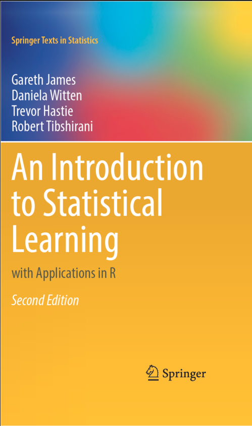
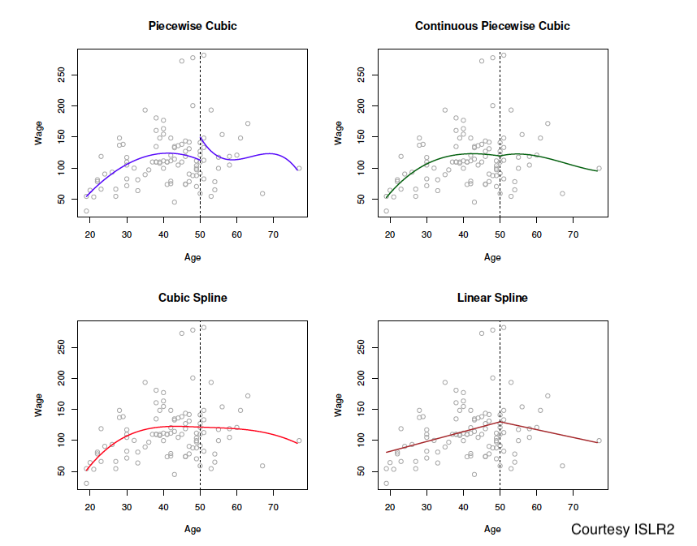

class: big, middle

```{r xaringan-tile-view, echo=FALSE}
xaringanExtra::use_tile_view()
knitr::opts_chunk$set(fig.height=4, fig.width=4, fig.align='center')
```

## Statistical Learning and Regression

---

## Outline

- Statistical Learning

- Linear regression

- Nonlinear regression

<!-- - Model selection: Bias-variance tradeoff -->


---

## Statistical Learning 

- *Statistical Learning* refers to a vast set of tools for understanding data

- Roughly speaking, the tools are classified as:
  
    - *Supervised learning*, which involves building a statistical model for predicting or estimating an output based on one or more inputs. 
        
        - E.g., regression and classification
        
        - We will be focusing on supervised learning in this module
    
    - *Unsupervised learning* models the structure in the inputs without a supervising output
    
        - E.g., hypothesis testing and confidence interval
---

In a supervised learning task, you are given data $(X_1,Y_1),\dots,(X_n,Y_n)$.

- The $X_i$ are predictors which could be multivariate

- The $Y_i$ are the response variable

| $Y_i$  | Problem| Example |
|:-------------------:|:-----------------:|:-----------------:
|quantitative | Regression| Wage: $50k$, $75k$, etc
|qualitative | Classification| Stock price: *increases* or *decreases* on day $i$

---

There are two main goals in supervised learning:

- *Prediction*, where the goal is to obtain a prediction $\hat{Y}_i$ of $Y_i$ as close as possible. E.g., "is the stock price going up?"

- *Inference*, which is to understand the relationship between $X_i$ and $Y_i$. The questions of interest are, e.g,

    - Which predictor is associated with the response? "What factors explain wage?"
    - What is the relationship between the response and each predictor? Linear or nonlinear?

---

- Machine learning is a closely related, partially overlapping area for solving the same problems as does statistical learning.

|Statistical learning | Machine learning |
|:-------------------:|:-----------------:|
|.bigg[Inference], Prediction | Inference, .bigg[Prediction]|

---

**Reference**: [An Introduction to Statistical Learning](https://www.statlearning.com/)

.center[

]

---
## E.g. for Regression: The wage data

The wage data contains income survey information for 3000 male workers from the central Atlantic region in the US. There are many predictive factors of wage included in the dataset. 

To obtain the `Wage` data, install the package `ISLR2` (just once) and load the package.

```{r}
library(ISLR2)
str(Wage)
```

---
class: big, middle

## Linear regression

---

## Quick review: Linear regression

In a regression setting, the responses $Y_i$ are continuous

- The *simple linear regression* considers only a single predictor, i.e. $p=1$. The model is written as

    $$Y_i = \beta_0 + \beta_1 X_{i1} + \epsilon_i$$

- The *(multiple) linear regression* considers any number of predictors, i.e. $p \ge 1$. The model is written as

    $$Y_i = \beta_0 + \beta_1 X_{i1} + \dots + \beta_p X_{ip} + \epsilon_i,$$

    for $i=1,\dots,n$. 

- In both cases, the relationship between the response and each predictor is *linear*. I.e., a unit increase in $X_{i1}$ is associated with $\beta_1$ units of increase in $Y_i$, *no matter what the current value of $X_{i1}$ is, fixing other predictors at any level*

- If there are multiple predictors, the regression effect of $X_{i1}$ is *difference* in the simple and the multiple  linear regression models. *One must consider the predictors jointly to see the true effects*

---

## Fitting a regression model

- To fit a regression model, *least squares* fit aims to minimize the residual sum of square (RSS)
$$\text{RSS} \mathrel{=} \sum_{i=1}^n [Y_i - (\beta_0 + \beta_1 X_{i1} + \dots + \beta_p X_{ip})]^2$$
over $(\beta_0,\dots,\beta_p)$

- The solution is the *least squares estimation* of $\boldsymbol{\beta}=(\beta_0,\dots,\beta_p)$ (refer to [a previous lecture](01_11_matrix.html#21)), defined as 
$$\hat{\boldsymbol{\beta}}=[\hat{\beta_{0}}\;\hat{\beta_{1}}\;\dots\;\hat{\beta_{p}}]^{T}=(\mathbf{X}^{T}\mathbf{X})^{-1}\mathbf{X}^T\mathbf{Y}$$

---
class: big, middle

## Nonlinear regression

---

## Nonlinear regression

- Linear regression models are 
    - easy to interpret and infer about, but 
    - they may not reflect complex relationship between the predictors and response, and 
    - may have limited predictive power

- Most generally, the model is
$$Y_i = f(X_{i1},\dots,X_{ip}) + \epsilon_i,$$
where $f$ is a *nonlinear* function. 

- Fortunately, nonlinear regression models are easily obtained by extending linear regression

---

## Polynomial regression


In the remaining of the slides, consider the case where $p=1$ and we have a single predictor $X_i = X_{i1}$. 

- Polynomial regression extends the linear model by including additional predictors obtained by raising the predictor to a power

- We model the nonlinear relationship as

$$Y_i = \beta_0 + \beta_1 X_{i}^1 + \dots + \beta_q X_{i}^q + \epsilon_i$$

- For example, a cubic regression ( $q=3$, degree 4) uses three variables, $X_i$, $X_i^2$, and $X_i^3$ as predictors

- We need to estimate $q+1$ parameters when fitting a degree $q+1$ polynomial regression with a single predictor. We say the model fitting takes up $q+1$ degrees of freedom (df)
    - An intercept-only model takes 1 df
    - Fitting a cubic regression takes 4 df

---
For illustration, consider a single predictor and a linear model
$$\text{wage}_i = \beta_0 + \beta_1\text{age}_i + \epsilon_i$$
```{r}
m1 <- lm(wage ~ age, Wage)
coef(summary(m1))
```

The quartic (4-th power) model is
$$\text{wage}_i = \beta_0 + \beta_1\text{age}_i + \beta_2\text{age}_i^2 + \beta_3\text{age}_i^3 + \beta_4\text{age}_i^4 + \epsilon_i$$ 

```{r}
m4 <- lm(wage ~ poly(age, 4), Wage)
coef(summary(m4))
```

---

```{r, fig.width=5, fig.height=5}
grid <- seq(min(Wage$age), max(Wage$age), length.out=100)
yhat4 <- predict(m4, newdata=data.frame(age=grid), se.fit = TRUE)
plot(Wage$age, Wage$wage, pch=".")
abline(m1, col="blue")
lines(grid, yhat4$fit, col="red", lwd=2)
lines(grid, yhat4$fit - 2 * yhat4$se, col="red", lwd=2, lty=2)
lines(grid, yhat4$fit + 2 * yhat4$se , col="red", lwd=2, lty=2)
```

---
## Multiple predictors

- If there are multiple predictors, polynomial regression includes higher-order power terms for one or more predictors. 

    E.g., age nonlinear effect + year of survey effect:
$$\text{wage}_i = \beta_0 + \beta_1\text{age}_i + \beta_2\text{age}_i^2 + \beta_3\text{age}_i^3 + \beta_4\text{age}_i^4 + \beta_5 \text{year} + \epsilon_i$$ 


---
class: inverse

## Your turn

Start with the `Wage` data in `library(ISLR2)`

 Use a cubic regression model to explain the `wage` response using `age` as a predictor. Also include the education levels as the second predictor.

 Visualize the age effect, and compare it with the model without including education as a predictor.
---

## Regression splines

- What if we want even more flexibility? Instead of using a single high-degree polynomial, we use a piecewise polynomial regression using a low-degree polynomial in each piece

- For example, a cubic regression funcion takes the form
$$Y_i = \beta_0 + \beta_1 X_{i}^1 + \beta_2 X_{i}^2 + \beta_3 X_{i}^3 + \epsilon_i$$


- A *piecewise cubic function* with a single *knot* at a point $c$ takes the form
$$Y_i = \begin{cases}
\beta_{01} + \beta_{11} X_{i}^1 + \beta_{21}X_{i}^2 + \beta_{31} X_{i}^3 + \epsilon_i & \text{if } X_i < c,\\
\beta_{02} + \beta_{12} X_{i}^1 + \beta_{22}X_{i}^2 + \beta_{32} X_{i}^3 + \epsilon_i & \text{if } X_i \ge c.
\end{cases}$$
It has 8 degrees of freedom.

- Using more knots leads to a more flexible function

---



---

- Unfortunately, the piecewise cubic fit (upper left) is discontinuous and looks bad

- A fix is to require that the cubic functions connect *smoothly* at the knot

- In the upper right plot, we added a contraint that the two pieces must connect at the knot. Now has 7 df. Better, but somewhat bizarre

- In the lower left plot, we have added two more constraints: The first and second derivatives must match up at the knot. Now has 5 df. Now the result is very smooth. 

- This results in a *cubic spline* function. It is a *piecewise cubic* (4th degree) function, and the derivatives up to 2nd order must agree at the knot

- Analogously, the lower right is a *linear spline*. It is a *piecewise linear* (2nd degree) function, and it must be continuous at the knot (0th order derivatives agree)

---

## Again, multiple regression

It turns out that regression splines can be easily implemented in the regression framework. 

- A cubic spline with $K$ knots can be written as
$$\begin{aligned}Y_i = \beta_0 & + \beta_1 X_i + \beta_2 X_i^2 + \beta_3 X_i^3 \\
& + \underbrace{\beta_{3+1} (X_i - \xi_1)_+^3 + \dots + \beta_{3+K}(X_i - \xi_K)_+^3}_{\text{a term for each knot}} + \epsilon_i,
\end{aligned}$$
where
$$(x-\xi)_+^3 = \begin{cases}
(x-\xi)^3 & \text{if } x > \xi,\\
0 & \text{otherwise}
\end{cases}$$

- A cubic spline with $K$ knots has $4 + K$ df

- A linear spline is obtained analogously. It has $2 + K$ df

- The formula means that, again, regression splines can be implemented by multiple linear regression

---
To implement cubic spline, either program it yourself, or use the `bs()` function
```{r spl, fig.width=5, fig.height=5, fig.show='hide'}
library(splines)
# Program it
cubic <- function(x, xi) {
  pmax((x - xi)^3, 0)
}
mSpl0 <- lm(wage ~ age + I(age^2) + I(age^3) + 
              cubic(age, 25) + cubic(age, 40) + cubic(age, 60), 
            data=Wage)

# Use bs()
mSpl <- lm(wage ~ bs(age , knots = c(25, 40, 60)), data = Wage)
yhatSpl <- predict(mSpl , newdata = list(age = grid), se = TRUE)
plot(Wage$age, Wage$wage, col = "gray", pch=".")
lines(grid, yhatSpl$fit, lwd = 2)
lines(grid, yhatSpl$fit + 2 * yhatSpl$se, lty = 2)
lines(grid, yhatSpl$fit - 2 * yhatSpl$se, lty = 2)
```

---


.center[
`)
]
- Function values on the left and right boundaries are hardest to estimate. So look there to tell whether you have a good fit or not

