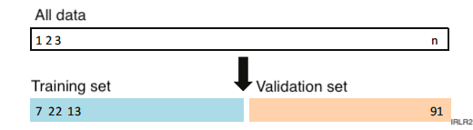
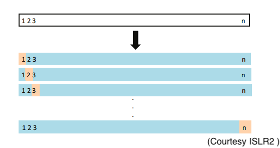
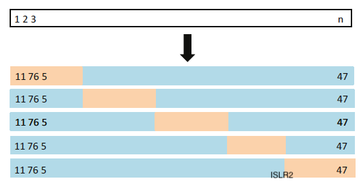

```{r xaringan-tile-view, echo=FALSE, message=FALSE}
xaringanExtra::use_tile_view()
library(tidyverse)
knitr::opts_chunk$set(fig.height=4, fig.width=4, fig.align='center',message = FALSE)
ggplot2::theme_set(ggplot2::theme_light(base_size = 16))
```

## Outline

- Measuring the quality of fit 

    - Mean squared error
    
    - Bias-variance trade-off

- Cross-validation

    - Leave-out-out CV
    
    - $k$-fold CV

- Case study

---
class: big, middle

## Measuring performance

---

## Measuring the quality of fit

In the most general case, the relationship between $Y$ and $p$ covariates $X=(X_1,\dots,X_p)$ follows
$$Y = f(X) + \epsilon,$$
where $\epsilon$ is a zero-mean measurement error independent of $X$.

The underlying regression function $f$ is unknown, but we can obtain an estimator $\hat{f}(x)$ (e.g., the least squares estimate for multiple regression). 
We can predict $Y$ using 
$$\hat{Y} = \hat{f}(X).$$

Define the mean squared error (MSE) as
$$E(Y - \hat{Y})^2,$$
which is the expected (long term average) squared error

---

The accuracy of $\hat{Y}$ for prediction $Y$ depends on two quantities:

- The *reducible* error, which can in principle be reduced to 0 given an appropriate model and a large sample

- The *irreducible* error cannot be reduced in any ways. This is due to the intrinsic variability in the noise $\epsilon$ which cannot be predicted. It could be sourced from unmeasured variables


- It can be shown that
$$
\begin{aligned}
\text{MSE} = E(Y-\hat{Y})^2 & = E[f(X) + \epsilon - \hat{f}(X)]^2 \\
& = \underbrace{E[f(X) - \hat{f}(X)]^2}_{\text{reducible}} + \underbrace{\mathrm{var}(\epsilon)}_{\text{irreducible}}
\end{aligned}
$$

- The modelers' goal is to minimize the reducible error


---

## Which model should I use?

If we knew MSE, we could use it to compare models. 

- E.g., choose the degree in a polynomial regression, or the number of knots in a spline regression

- It is possible to know MSE only if we simulated the data.

- However, the MSE is unknown and thus needs to be estimated

---
## Example: A simulated dataset
We have simulated a dataset below, which has a nonlinear relationship between $Y$ and $X$:

$$Y = \sin(2\pi X) + \epsilon$$

```{r, echo=FALSE,fig.height=5, fig.width=5}
f <- function(x) sin(2 * pi * x)
n <- 100
sigma <- 1
X <- sort(runif(n))
Y <- f(X) + rnorm(n, sd=sigma)
plot(X, Y, pch=16)
lines(X, f(X), lwd=2)
```

Suppose we did not know the underlying model. What model to use?

---
## MSE in a simulation

Fit polynomial regression models with degree up to 9, and obtain the *true* MSE, reducible errors, and irreducible errors *from simulation*
```{r,echo=FALSE, cache=TRUE}
library(tidyverse)
MC <- 100
nNew <- 2000
qVec <- 1:12
set.seed(1)
fitPoly <- function(y, x, q) {
  form <- sprintf("y ~ poly(x, %d)", q)
  form <- as.formula(form)
  lm(form)
}
nInf <- 5000
mInf <- map(qVec, function(q) {
  X <- sort(runif(nInf))
  Y <- f(X) + rnorm(nInf, sd=sigma)
  fitPoly(Y, X, q)
})
res <- map_dfr(seq_len(MC), function(i) {
  # Generate data
  X <- sort(runif(n))
  Y <- f(X) + rnorm(n, sd=sigma)
  imap_dfr(qVec, function(q, i) {
    # Fit model
    m <- fitPoly(Y, X, q)
    YHat <- predict(m)
    # Generate new data to evaluate fit
    XNew <- runif(nNew)
    epsNew <- rnorm(nNew, sd=sigma)
    YNew <- f(XNew) + epsNew
    YHatNew <- predict(m, newdata=data.frame(x=XNew))
    YHatInf <- predict(mInf[[i]], newdata=data.frame(x=XNew))
    c(q=q,
      Reducible=mean((YHatNew - f(XNew))^2), 
      Irreducible=mean(epsNew^2),
      MSE=mean((YHatNew - YNew)^2), 
      Training = mean((YHat - Y)^2),
      SqBias = mean((YHatInf - f(XNew))^2), 
      Variance = mean((YHat - YHatInf)^2)
      )
  })
})
```
```{r,echo=FALSE, fig.height=5, fig.width=6}
plotDat <- res %>%
  pivot_longer(-q) %>%
  group_by(q, name) %>%
  summarize(value = mean(value)) %>%
  ungroup() %>%
  mutate(name = factor(name, 
                       c("MSE", 
                         "Reducible", 
                         "Irreducible", 
                         "Training",
                         "SqBias",
                         "Variance"))) %>%
  mutate(value = ifelse(name == "Irreducible", 
                        mean(value[name == "Irreducible"]),
                        value))

plotDat %>%
  filter(name %in% c("MSE", "Reducible", "Irreducible")) %>%
  ggplot(aes(x = q, y = value, color=name)) + geom_line()
# total <- map(res, map_dbl, "total")
# total <- do.call(rbind, total)
# plot(qVec, colMeans(total), type="l", xlab="degree - 1", ylab="MSE", main="MSE from simulation")
```

- Thus using a polynomial regression up to a cubic term $q=3$ is the best choise
- There is a considerable window of $q$ that results in similar results

---
## Demo

---

## Training MSE

- Of course, the true MSE is unaccessible when we are not doing simulation

- The data $(X_1,Y_1),\dots,(X_n,Y_n)$ used to fit the model is called the *training data*

- A possible alternative is the *training MSE*
$$\frac{1}{n}\sum_{i=1}^n(Y_i - \hat{f}(X_i))^2,$$
evaluated at the training data. Also, $\hat{f}$ is trained using the same data

- But this won't work for evaluating the model, as we will see

- In general, we do not really care how the model perform on the training data

- We are really interested in the performance when we obtain new and unseen *test data*

---

## Test MSE

Let $(X_0, Y_0)$ be a previously unseen *test observation* not used to train
the model.

- The test MSE is 
$$\mathrm{Ave}(Y_0 - \hat{f}(X_0))^2,$$
where the average is taken over many new test observations $(X_0, Y_0)$

- The test MSE is a good metric for the model performance 
- When selecting a model, our goal is to select the one that minimizes the test MSE

- Sometimes, there is a test dataset available. I.e., there is a separate dataset which you did not use to fit the data. You can then evaluate the test MSE using the test dataset

    - This is not always possible, and 
    - not using the test set to fit the model is a waste of data
    
---

## Why minimizing training MSE fails

- Minimizing training MSE might seem appealing since it looks like the test MSE. But this approach just *fails*
    
- The reason is that the training MSE is always smaller for a more flexible model

- But a more flexible model does not necessarily mean a lower test MSE

    - A model interpolating all the data points is going to give a 0 training error. But this will perform poorly given new data
    
```{r, echo=FALSE, fig.height=4, fig.width=5}
plot(X, Y, type="o", pch=16, main="The most flexible model")
points(0.45, -0.5, pch="x", col="red", cex=2)
```
    
---

```{r, echo=FALSE, fig.width=7, fig.height=6}
plotDat %>%
  filter(name %in% c("MSE", "Training")) %>%
  mutate(name = factor(name, c("Training", "MSE"), c("Training MSE", "Test MSE"))) %>%
  ggplot(aes(x = q, y = value, color=name)) + geom_line() + xlab("Flexibility (q)")
```

---

## The bias-variance trade-off

The U-shape observed in the test MSE is the result of two competing properties of a model: *bias* and *variance*

The *expected test MSE* is the sum of three terms:
$$
\begin{aligned}
E[Y_0-\hat{f}(X_0)]^2 = \underbrace{\{E[\hat{f}(X_0) - f(X_0)]\}^2}_{\text{squared bias}} + \underbrace{\text{var}(\hat{f}(X_0))}_{\text{variance}} + \underbrace{\mathrm{var}(\epsilon)}_{\text{irreducible error}}
\end{aligned}
$$

- The bias and variance terms sum up to the reducible error

- When selecting a model, our goal is to simultaneously achieve low bias and low variance

---
$$
\begin{aligned}
E[Y_0-\hat{f}(X_0)]^2 = \underbrace{\{E[\hat{f}(X_0) - f(X_0)]\}^2}_{\text{squared bias}} + \underbrace{\text{var}(\hat{f}(X_0))}_{\text{variance}} + \underbrace{\mathrm{var}(\epsilon)}_{\text{irreducible error}}.
\end{aligned}
$$

- *Bias* is the lack of flexibility in our model to approximate the true $f$, regardless of how many training observations we have. 
    - E.g., using a line to approximate a curvilinear relationship will incur a bias. More data does not help the fact that we cannot fit a curve with a line
    - flexibility $\uparrow$, bias $\downarrow$
    
- *Variance* refers to how much $\hat{f}$ varies if we use a different training data set. To fit a more flexible model needs to estimate more parameters
    - flexibility $\uparrow$, variance $\uparrow$

- The relationship between bias and variance as the flexibility of the model change is referred to as the *bias-variance trade-off*

- We want to select a flexible but not too flexible model in a happy middle ground

---

Our simulation:
```{r, echo=FALSE, fig.width=7, fig.height=6}
plotDat %>%
  filter(name %in% c("MSE", "SqBias", "Variance")) %>%
  mutate(name = factor(name, c("MSE", "SqBias", "Variance"))) %>%
  ggplot(aes(x = q, y = value, color=name)) + geom_line() + xlab("Flexibility (q)")
```

- Given a real dataset, it is generally not possible to compute the test MSE, bias, or variance exactly

- Nevertheless, one should always keep the bias-variance trade-off in mind

---
class: big,middle

## Cross-validation

---

## The validation set approach

- Our goal is to estimate the test MSE

- The *validation set approach* is to randomly divide the set of all observations into two parts, a *training set* and a *validation set* (or *hold-out set*)

- The model is fit on the training set, and the evaluation of model is done on the validation set

.center[

]

---

- Advantage: Erorrs are evaluated on a dataset *independent* of the training data, so no memorization (unlike the training MSE)

- Drawbacks:
    - The estimate of the test error rate can be highly variable, depending on the split
    
    - Tend to overestimate the test error, since methods tend to perform
worse given fewer observations to train

---

## Leave-One-Out Cross-Validation

*Leave-one-out cross-validation* (LOOCV) addresses the drawbacks of the validation set approach.

.center[

]
1. split the set of observations into two parts, a validation set having a single observation $(X_1,Y_1)$, and a training set containing the rest $\{(X_2,Y_2),\dots,(X_n,Y_n)\}$
1. Fit on the training set, and make prediction for the validation data. Evaluate test error on the validation data
1. Repeat the procedure by holding out every original observation, one at a time, as the training set
1. Average test errors over all repeats

---

## Why LOOCV works

- In the $i$th split, for $i=1,\dots,n$, the model is trained using $\{(X_1,Y_1),\dots,(X_{i-1},Y_{i-1}),(X_{i+1},Y_{i+1}), (X_n,Y_n)\}$

- In the $i$th fitting process, the prediction is made for $(X_i, Y_i)$ independent of the data used for training. So $\text{MSE}_i = (Y_i - \hat{Y}_i)^2$ is an approximately unbiased estimate for the test MSE. 
    - The $i$th test error alone could have a large variability

- The LOOCV estimate for the test MSE pools all $n$ test errors, and is
$$\text{CV}_{(n)} = \frac{1}{n}\sum_{i=1}^n \text{MSE}_i.$$
    - By averaging, this test error has a smaller variability

<!-- - LOOCV can be used to evaluate any regression or classification methods -->

---

## LOOCV benefits and drawbacks

Benefits of LOOCV over the validation set approach:

- Less bias, since $n-1$ observations are used for training each time
  - We would like to evaluate the model performance using $n$ obs

- Less randomness, since the splits are non-random
    
Potential drawbacks of LOOCV:

- Expensive computation, since the model needs to be fit $n$ times

    - Just so you know, there is a magical formula to perform LOOCV in a *single* model fit. It only applies to a wide range of linear models:
    $$\text{CV}_{(n)} = \frac{1}{n}\sum_{i=1}^n \left(\frac{Y_i-\hat{Y}_i}{1-h_{ii}}\right)$$

<!-- - But still, in general, LOOCV requires $n$ model fits -->

---

## $k$-fold cross-validation

An alternative to LOOCV is *k-fold cross-validation* (CV). The figure illustrates the 5-fold CV:


.center[

]

---
k-fold CV:
1. Randomly divide the set of observations into $k$ groups, or *folds*, of approximately equal size
1. The first fold is treated as a validation set, and the model is fit on the remaining $k-1$ folds. Evaluate the prediction on the validation set (held-out fold)
1. Repeat the previous process for each of the $k$ folds
1. Average over the $k$ folds and obtain $k$-fold CV estimate
$$\text{CV}_{(k)} = \frac{1}{k}\sum_{i=1}^n \text{MSE}_i.$$

- LOOCV is the same as the $n$-fold CV

- Typically, $k=5$ or $k=10$ fold CV are used

---

## Advantages of $k$-fold CV

Advantages of $k$-fold CV:

- $k$-fold CV is computationally more efficient than LOOCV, since the former fits the model only $k$ times

- More importantly, $k$-fold CV is more accurate for estimating the true test MSE curve than the LOOCV

The reason lies in bias-variance tradeoff. 
- When performing LOOCV, we are averaging the prediction made by $n$ highly correlated models
  - small bias but large variance
  <!-- - Each model has a *very small bias* since they use all but 1 observations -->
  <!-- - Each model differs by only $1$ observation, so they are highly correlated with each other -->
  <!-- - The average test error of highly correlated variables will have a *high variability* -->
- In contrast, the models fitted in $5$-fold CV are less correlated
  - larger bias but smaller variance
<!-- , so averaging is going to help more in reducing the variance, though the bias is slightly increased. Again, $k=5$ or $10$ are good choices in practice -->

---

## A general way for supervised learning

In fact, a learning task often involve the many models/options to choose from. The procedure often go as follows

1. Define an objective to optimize (e.g., minimize MSE for regression, or minimize misclassification rate for classiciation)

1. Define a fair way to evaluate each model (e.g., for supervised learning, MSE estimated by LOOCV or $k$-fold CV, *not* training MSE)

1. Choose the model that perform the best according to your evaluation

1. Fit the best model using all data

---

## Case study: Evaluating polynomial regression

Consider the wage data. Our goal is to predict the wage with age using a polynomial regression

$$\text{wage}_i = \beta_0 + \beta_1\text{age}_i + ... + \beta_q\text{age}_i^q + \epsilon_i.$$ 

Our goal: Apply cross-validation to select the tuning parameter $q$ and achieve the smallest prediction error

For illustration, use just the first 200 observations for speed.

---

```{r, wageLOOCV, eval=FALSE}
qVec <- 1:10
dat <- Wage[1:200, ]
n <- nrow(dat)

# LOOCV
MSEi <- map_dfr(seq_len(n), function(i) {
  datTrain <- dat[-i, ]
  datTest <- dat[i, ]
  
  res <- map_dbl(qVec, function(q) {
    m <- lm(wage ~ poly(age, q), datTrain)
    err <- datTest$wage - predict(m, datTest) 
    mean(err^2)
  })
  setNames(res, qVec)
})
MSECV <- colMeans(MSEi)
plot(qVec, MSECV, type="b", main="MSE estimated by LOOCV")

qSelect <- qVec[which.min(MSECV)]
finalModel <- lm(wage ~ poly(age, qSelect), Wage)
```

---

Test error for $n=200$ observations
```{r, wageLOOCV, echo=FALSE, fig.height=6, fig.width=6, eval=TRUE, cache=TRUE}
```

- Using the bias-variance trade-off principle, what $q$ do you think will be selected when we include all $n=3000$ observations? 

---
We now include all $n=3000$ observations and use 5-fold CV for speed

The `glm` function can be used together with `cv.glm` in `library(boot)` to evaluate cross-validated MSE

```{r}
library(boot)
q <- 2
m <- glm(wage ~ poly(age, q), dat, family="gaussian")
res <- cv.glm(dat, m)
res$delta[1] # LOOCV error

# 5-fold CV
err5Fold <- map_dbl(qVec, function(q) {
  m <- glm(wage ~ poly(age, q), dat, family="gaussian")
  res <- cv.glm(dat, m, K=5)
  res$delta[1] # LOOCV error
})
```

---
```{r, fig.height=5, fig.width=6}
plot(qVec, err5Fold, type="o")
```
