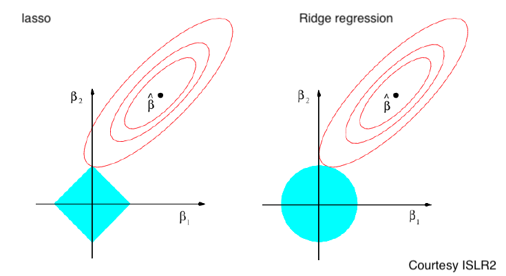

```{r xaringan-tile-view, echo=FALSE}
xaringanExtra::use_tile_view()
knitr::opts_chunk$set(fig.height=4, fig.width=4, fig.align='center')
```

## Outline

- Regularization

- Ridge regression

- The lasso

- Selecting tuning parameters

---

## Regularization

There are two approaches to improve a regression model:

- Increase flexibility and reduce bias: 
  
  - Polynomial regression and regression splines
  
  - Useful for modeling nonlinear effects

- Increase stability and reduce variance
  - Ridge regression and the lasso are like linear regression
  
  - Impose constraint/regularization
  
  - Useful when there are many predictors

---
class: middle, big

## Ridge regression

---

## Ridge regression


- The *least squares* procedure minimizes the residual sum of square (RSS)
$$\text{RSS} \mathrel{=} \sum_{i=1}^n \left( Y_i - \beta_0 - \sum_{j=1}^p \beta_j X_{ij}\right)^2$$
over $(\beta_0,\dots,\beta_p)$

- Ridge regression is very similar, except that it minimizes a penalized (regularized) objective
$$\begin{aligned}
\text{RSS} + \underbrace{\lambda \sum_{j=1}^p \beta_j^2}_{\text{Shrinkage penalty}} = \sum_{i=1}^n \left( Y_i - \beta_0 - \sum_{j=1}^p \beta_j X_{ij}\right)^2 + \lambda \sum_{j=1}^p \beta_j^2,
\end{aligned}$$
where $\lambda \ge 0$ is a *tuning parameter*
- Ridge regression trades off model fitting (RSS) and the size of the slope parameters

---

The ridge regression estimates are
$$\begin{aligned}
(\hat\beta_{0,\lambda}^R,\dots,\hat\beta_{p,\lambda}^R) = \mathop{\text{argmin}}_{(\beta_0,\dots,\beta_p)} \sum_{i=1}^n \left( Y_i - \beta_0 - \sum_{j=1}^p \beta_j X_{ij}\right)^2 + \lambda \sum_{j=1}^p \beta_j^2
\end{aligned}$$

- Given the value of $\lambda$, ridge regression outputs a set of coefficient estimates

- When $\lambda = 0$, the ridge estimate is the same as the least squares estimate

- A large shrinkage $\lambda$ encourages the slope estimate to have small entries

- The shrinkage penalty is applied to only the slopes $\beta_1,\dots,\beta_p$ but not the intercept $\beta_0$. This way the slope estimate $\hat\beta_{0,\lambda}^R$ will always be $\bar{Y}$

- The precise choice of $\lambda$ is critical and we will determine that using CV
---

The ridge regression estimate $\hat{\boldsymbol{\beta}}_\lambda^R=(\hat\beta_{0,\lambda}^R,\dots,\hat\beta_{p,\lambda}^R)$ 
<!-- $$\begin{aligned} -->
<!--  \mathop{\text{argmin}}_{(\beta_0,\dots,\beta_p)} \sum_{i=1}^n \left( Y_i - \beta_0 - \sum_{j=1}^p \beta_j X_{ij}\right)^2 + \lambda \sum_{j=1}^p \beta_j^2 -->
<!-- \end{aligned}$$ -->
can be obtained in a closed form as
$$\hat{\boldsymbol{\beta}}_\lambda^R=({X}^{T}{X} + \lambda D)^{-1}{X}^T{Y}$$
where $D=\text{diag}(0, 1, \dots, 1)$ is a diagonal matrix.

- If $\mathbf{X}^T\mathbf{X} = I$ (i.e. the predictors all have mean 0 and standard deviation 1 and are uncorrelated), then 
$$\hat\beta_{j,\lambda}^R = \frac{1}{1+\lambda}\hat\beta_j$$
where $\hat\beta_j$ is the least squares estimate.
    - This explains why the method is a "shrinkage" method

- For a record with covariates $\mathbf{x}_0 = [1\; x_{01}\; \dots\; x_{0p}]^T$, the prediction made by ridge regression is

$$\hat{Y}_0 = \mathbf{x}_0^T \hat{\boldsymbol{\beta}}_\lambda^R$$


---

## E.g., the credit dataset

The `Credit` dataset in `library(ISLR2)` records variables for a number of credit card holders. 

.center[

]

---

- The response: `balance` (average credit card debt for each individual) 

- Quantitative predictors: 
    - `Age`, 
    - `Cards` (number of credit cards), 
    - `Education` (years of education), 
    - `Income` (in thousands of dollars), 
    - `Limit` (credit limit), and 
    - `Rating` (credit rating)
    
- Qualitative variables: 
    - `Own` (house ownership), 
    - `Student` (student status), 
    - `Married` (marital status), and 
    - `Region` (East, West or South)

---

## Results from the ridge regression

.center[

]

- The two figures differ only in how the x-values are arranged and scaled. $||\beta||_2$ is the $l_2$-norm defined as $||\beta||_2 = (\sum_{j=1}^p\beta_j^2)^{1/2}$

- As $\lambda$ increases, the ridge coefficient estimates shrink towards zero (but are never exactly 0), approaching an intecept-only model

---

.center[

]
- The least square estimates are *scale invariant*, meaning that $X_j\hat\beta_j$ stays the same when the $j$th predictor is multipled by a constant

- However, the ridge regression estimates are not scale invariant. The results would be dramatically different if income is measured in dollars rather than $1,000

- Thus, the predictors are usually standaridized before input to the ridge regression using
$$\tilde{X}_{ij} = \frac{X_{ij} - \bar{X}_j}{\sqrt{n^{-1}\sum_{i=1}^n (X_{ij} - \bar{X}_j)^2}}$$
This will make the shrinkage effect balanced for all predictors

---
class: big, middle

## The lasso

---
## The lasso

- Ridge regression will include all $p$ predictors in the final model since the coefficients are never exactly zero

- This may not be a problem for prediction, but it may be a problem for interpretation
    - especially when there are a large number of predictors.
    - In the `Credit` dataset, we manually identified only four important variables (income, limit, rating, and student), but this is hard in general
    
- *The lasso* is an alternative to ridge regression that addresses this issue

- The lasso coefficients $\hat{\boldsymbol{\beta}}_\lambda^L=(\hat\beta_{0,\lambda}^L,\dots,\hat\beta_{p,\lambda}^L)$ minimizes
$$\text{RSS} + \underbrace{\lambda \sum_{j=1}^p |\beta_j|}_{\text{lasso penalty}} = \begin{aligned}
\sum_{i=1}^n \left( Y_i - \beta_0 - \sum_{j=1}^p \beta_j X_{ij}\right)^2 + \lambda \sum_{j=1}^p |\beta_j|
\end{aligned}$$

---

Compare the lasso
$$\begin{aligned}
\hat{\boldsymbol{\beta}}_\lambda^L = \mathop{\text{argmin}}_{(\beta_0,\dots,\beta_p)} \sum_{i=1}^n \left( Y_i - \beta_0 - \sum_{j=1}^p \beta_j X_{ij}\right)^2 + \lambda \sum_{j=1}^p |\beta_j|,
\end{aligned}$$
to ridge regression
$$\begin{aligned}
\hat{\boldsymbol{\beta}}_\lambda^R = \mathop{\text{argmin}}_{(\beta_0,\dots,\beta_p)} \sum_{i=1}^n \left( Y_i - \beta_0 - \sum_{j=1}^p \beta_j X_{ij}\right)^2 + \lambda \sum_{j=1}^p \beta_j^2
\end{aligned}$$

- The only differences: The lasso penalizes based on the $l_1$-norm $||\beta||_1 = \sum |\beta_j|$, while ridge regression penalizes the $l_2$-norm $||\beta||_2 = (\sum \beta_j^2)^{1/2}$ of $\beta$

- Like ridge regression, the lasso shrinks the coefficient estimates towards 0

- **Unlike ridge regression**, the lasso tends to produce coefficients exactly equal to zero (*sparse*) when $\lambda$ is sufficiently large
    - Effectively, the lasso performs *variable selection*

---

## The lasso applied on the credit dataset

.center[

]

- When $\lambda = 0$, the lasso simply gives the least squares fit

- When $\lambda$ becomes sufficiently large, the lasso gives the intercept-only model where all slope estimates are zero

- In between, many small coefficients are shrunk to zero exactly

- Depending on $\lambda$, the lasso can produce a model involving any number of variables

- In contrast, ridge regression will always include all variables

---

## Alternative formulations 

The (constrained form of) lasso solves
$$\mathop{argmin}_{(\beta_0,\dots,\beta_p)} \sum_{i=1}^n \left( Y_i - \beta_0 - \sum_{j=1}^p \beta_j X_{ij}\right)^2 \text{ subject to  } \sum_{j=1}^p|\beta_j| \le s,$$
and ridge regression solves
$$\mathop{argmin}_{(\beta_0,\dots,\beta_p)} \sum_{i=1}^n \left( Y_i - \beta_0 - \sum_{j=1}^p \beta_j X_{ij}\right)^2 \text{ subject to  } \sum_{j=1}^p\beta_j^2 \le s.$$

- In other words, for every $\lambda$ in the original (regularized) form, there is an $s$ that gives the same solution 

---

.center[

]

- Points on the same contour have the same objective value (RSS)

- The constraints ( $\sum_{j=1}^p|\beta_j|$ and $\sum_{j=1}^p\beta_j^2$) are *budgets*. The do not matter when $s$ is large, and they come into play when $s$ is small

- The constraint region for the lasso is pointy, so an optimal solution (the intersect of the constraint region and the contour just touching it) tends to be at the corners, which results in a sparse solution

---
## Special case
- If $\mathbf{X}^T\mathbf{X} = I$, then the lasso estimates are
$$\hat\beta_{j,\lambda}^L = \text{sign}(\hat\beta_j)(|\hat\beta_j| - \lambda)_+,$$
for $j=1,\dots,p$, where $\hat\beta_j$ is the least squares estimate.
    - The lasso is *soft thresholding* the LS estimate

- Compare with the ridge regression estimates are 
$$\hat\beta_{j,\lambda}^R = \frac{1}{1+\lambda}\hat\beta_j$$

    
.center[

]

---
## Comparing the Lasso and Ridge Reg.

- There are very efficient algorithms for fitting both ridge and lasso models

- Lasso produces zero coefficient estimates and thus are more interpretable than ridge regression

- In terms of prediction, either model could perform better than the other, depending on the data-generating mechanism

    - Case 1: If many predictors are meaningful, e.g. $Y = 0.01 X_1 + 0.01 X_2 + 0.01 X_3 + \dots + 0.01 X_{100} + \epsilon$, then ridge regression will perform better than lasso
    
    - Case 2: If only few predictors are meaningful, e.g. $Y = 1 X_1 + 1 X_2 + 0 X_3 + \dots + 0 X_{100} + \epsilon$, then the lasso will perform better than ridge regression

---

Case 1:</br>

- Solid: The lasso; dashed: ridge. <span style="color:DeepPink">MSE</span>, bias, <span style="color:green">variance</span>
- The x-axis scale on the right let us show the lasso and ridge regression on the same plot

Case 2:</br>


---

- In both cases, $\lambda=0$ for no regularization/no constraint (LS estimates) did not lead to the best result

- This is, again, because of the bias-variance trade-off. The constraints result in smaller model spaces, so the bias is increased in exchange for greater model stability

- The overall MSE is the smallest under moderate regularization

---

## Selecting the tuning parameter

Cross-validation provides a way to estimate the test MSE: 

1. Choose a grid of $\lambda$ values, and compute the CV error for each $\lambda$

1. Select the tuning parameter value for which the CV error is minimized (the *minimization rule*)

1. The model is re-fit using all of the available observations and the selected value of the tuning parameter 

An alternative rule is the *1 standard error* rule (1se rule)

  - Idea: Pick the simplest model not much worse than the one giving the minimal CV error
  
  - In Step 2, selects the least complex model (largest value of $\lambda$) such that CV error is within 1 standard error of the minimum
  
  - This often shows better predictive performance in practice

 
---

## Code implementation

We will use the `glmnet` package to perform ridge regression and the lasso, and cross-validation for estimating the test error. 
Install it (once) if you have not done so. 
We are going to look at the ames house price data. Load `library(classdata)` and look at `?ames`.

The `glmnet` function performs both ridge regression and the lasso. Set
- `alpha = 0` for ridge regression
- `alpha = 1` for the lasso

---

.scroll-output[
```{r, eval=FALSE}
library(glmnet)
library(classdata)
library(glmnet)
# glmnet needs a matrix input; convert to design matrix
str(ames)

X <- model.matrix(SalePrice ~ . - Neighborhood, ames)[, -(1:2), drop=FALSE]
y <- ames$SalePrice
ridge <- glmnet(X, y, alpha=0)

beta <- coef(ridge)
dim(beta)
ridge$lambda[59]
beta[, 59]

matplot(log(ridge$lambda), t(beta[-1, , drop=FALSE]), type="l", lwd=2)
legend("topright", rownames(beta)[-1], col=1:6, lty=1:5, lwd=2)

lambda1 <- 50000
beta1 <- predict(ridge, s=lambda1, type="coefficients")[, 1]
resp <- predict(ridge, newx=X, s=lambda1, type="response")

# Set aside a test set to estimate the prediction error
set.seed(123)
testInd <- sample(n, round(n/2), replace = FALSE)
trainInd <- setdiff(seq_len(n), testInd)

ridgeTrain <- glmnet(X[trainInd, , drop=FALSE], y[trainInd], alpha=0)
yPredTest <- predict(ridgeTrain, newx = X[testInd, , drop=FALSE], 
                     type="response")
testMSE <- colMeans((yPredTest - y[testInd])^2)
plot(log(ridgeTrain$lambda), testMSE, type="l")

# Use CV to select lambda, and then estimate the prediction error
# Default: 10-fold
ridgeCV <- cv.glmnet(X[trainInd, ], y[trainInd], alpha=0) # the glmnet.fit field is a fit for the full data. 
str(ridgeCV)
plot(ridgeCV)
lambda2 <- ridgeCV$lambda.min
lambda3 <- ridgeCV$lambda.1se
yPredTest <- predict(ridgeCV, newx = X[testInd, , drop=FALSE], 
                     s=c(lambda2, lambda3),
                     type="response")
testMSERidge <- colMeans((yPredTest - y[testInd])^2)
sqrt(testMSERidge)

## The lasso
lassoCV <- cv.glmnet(X[trainInd, ], y[trainInd], alpha=1, 
                     lambda=10^seq(2, 5, length.out=100))
plot(lassoCV)
lambda4 <- lassoCV$lambda.min
lambda5 <- lassoCV$lambda.1se
betaMin <- predict(lassoCV, s="lambda.min", type="coefficients")
beta1se <- predict(lassoCV, s="lambda.1se", type="coefficients")
betaAll <- predict(lassoCV$glmnet.fit, type="coefficients")

yPredTest <- predict(lassoCV, newx = X[testInd, , drop=FALSE], 
                     s=c(lambda4, lambda5),
                     type="response")
testMSELasso <- colMeans((yPredTest - y[testInd])^2)
sqrt(testMSELasso)
# ridge has slightly better predictive performance

# lasso solution paths
matplot(log(lassoCV$lambda), t(betaAll[-1, , drop=FALSE]), type="l", lwd=2)
legend("bottomright", rownames(beta)[-1], col=1:6, lty=1:5, lwd=2)
```
]
