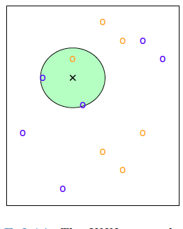
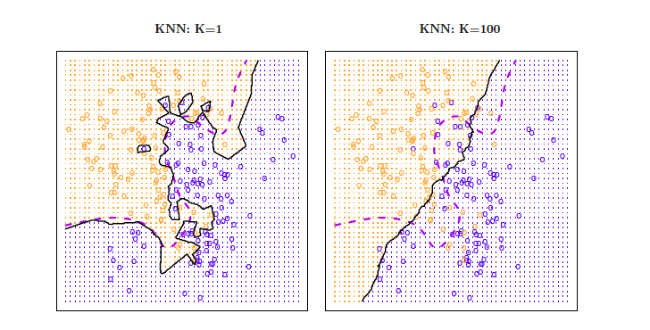
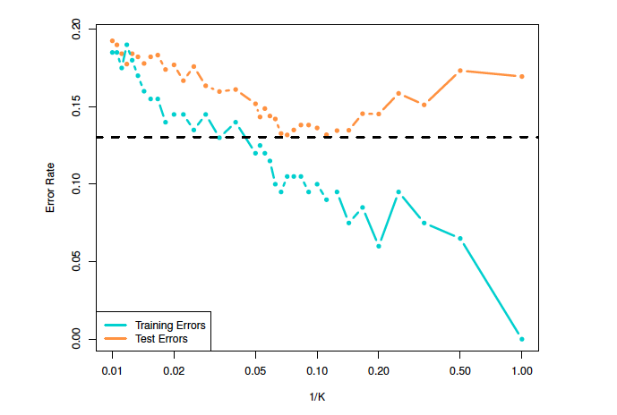
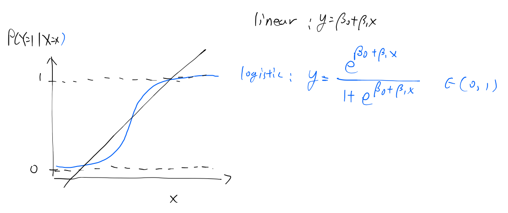

```{r xaringan-tile-view, echo=FALSE}
xaringanExtra::use_tile_view()
knitr::opts_chunk$set(fig.height=4, fig.width=4, fig.align='center')
```

## Outline

- The classification problem

- K-nearest neighbhor method

- Logistic regression

---

class: big,middle

## The classification task

---

## The classification setting

- Problems involving a qualitative response $Y$ are often referred to as classification problems

- $Y$ is one of $J$ possible class labels
    - $J=2$: Binary classification. E.g., default/no default
    - $J>2$: Multiclass classification. E.g., spam/normal/important

- Our goals are to obtain (1) a class label prediction $\hat{Y}$, and (2) an estimate for the probability $P(Y = j \mid X=x)$ for $Y$ to fall in class $j$, given the predictor is $x$

- Many of the concepts that we have encountered, such as model selection and the bias-variance trade-off, transfer over to the classification setting

---

- Since we have qualitative response, the most common objective is to minimize the *misclassification error rate*
$$E[\mathrm{1}\{Y \ne \hat{Y}\}]$$

- There are other practically meaningful objectives, but we are going to focus only on the one above

- Similar to the regression setting, we have the training error rate
$$\frac{1}{n}\sum_{i=1}^n \mathrm{1}\{Y_i \ne \hat{Y}_i\}.$$
Again, this is not a good quantifier of model performance

- The *test error* rate for a set of new test observatisons $(X_0,Y_0)$ is
$$\text{average}(\mathrm{1}\{Y_0 \ne \hat{Y}_0\}),$$
which is a fair quantification of the model performance 

---

## Confusion matrix

Given $n$ observations, the confusion matrix (say, constructed using the test data) is a tabulation of the predicted labels and the true labels

.plainTable[
|   | Actual positive | Actual negative|
|:--:|:------:|:-----:|
|Predicted positive | $a$ | $b$ |
|Predicted negative | $c$ | $d$ |
]

Two summaries are obtained from the confusion matrix:

- Sensitivity = True positive rate = $a / (a + c)$

- Specificity = True negative rate = $d / (b + d)$

- The goal is to have high sensitivity and specificity *at the same time*

- Not meaningful to have only one of them high:

  - A method that predicts all positive will have sensitivity=1 but  specificity=0
  - A method that predicts all negative will have sensitivity=0 but  specificity=1
---

## The Bayes classifier

The theoretical best classifier that minimizes the misclassification error is the *Bayes classifier* that assigns each observation to the most likely class,
given its predictor values

- It assigns a test obervation with predictors $x$ to the class $j$ for which
$$P(Y=j \mid X = x)$$
is largest

- Suppose we have only two classes, so $j \in \{0, 1\}$. The Bayes classifier would predict class 1 if $$P(Y = 1\mid X=x) > 1/2,$$ 
and class 0 otherwise

- The error rate made by the Bayes classifier is the *Bayes error rate*. This cannot be further reduced by improving the classifier

- The Bayes classifier is unattainable gold standard, but useful for designing classifiers

---
The Bayes classifier assigns a test obervation with predictors $x$ to the class $j$ for which
$$P(Y=j \mid X = x)$$
is largest.

- The Bayes classifier offers an idea to frame the classification problem: We target to estimate the conditional probability $P(Y=j \mid X=x)$

- There are many different ways to approach this, resulting in different classifiers

---

## Classification vs regression

- If there are two classes $j\in \{0, 1\}$, one could regard the response as continuous and perform a regression.

- In fact, 
$$P(Y=j \mid X=x) = E[\mathrm{1}\{Y = j\} \mid X=x],$$
so we can think about the conditional probability as a regression function $f(x)$, like in linear regression

- Then why bother classification models? 

    - The major reason lies in the *objectives*. Regression aims to minimize mean squared error (degree of difference), and classification aims to minimize misclassification (any difference at all). A regression model is optimal for the former but not the latter
    
    - Regression cannot be applied if the response has multiple classes that are not ordered (e.g., multiple diagnosis or ethnicity)
    
    - Regression could produce probability estimates outside of $[0,1]$

---

class: big,middle

## $K$-nearest neighbors

---

## $K$-nearest neighbors

- The $K$-nearest neighbors (KNN) classifier: "If the predictors are alike, the response should also be similar"

- KNN estimates the conditional probability for class $J$ using 
$$\hat{P}(Y=j\mid X=x) = \frac{1}{K}\sum_{i\in \mathcal{N}_0} \mathrm{1}\{Y_i  = j\},$$
where $\mathcal{N}_0$ is a neighborhood of $x$ containing the $K$-nearest neighbors

---

- 3-NN prediction for $x$ at the cross:</br>
.center[]

- The neighborhood contains 2 blue points and 1 orange point

- Neighbors vote to determine the predicted probability. $\hat{P}(Y=\text{blue}\mid X=x) = 2/3$

- Since $\hat{P}(Y=\text{blue}\mid X=x) > 1/2$, KNN will predict $Y_0=\text{blue}$ for $x$

- This process can be repeated for any predictor value

---

**Defining neighbors**

Most often, the *Euclidean distance* is used to define the neighbors. 
For $a = (a_1,\dots, a_p)$ and $b = (b_1,\dots, b_p)$, the Euclidean distance (also refered to as the $l_2$ distance) is
$$d(a, b) = \sqrt{\sum_{j=1}^n (a_j - b_j)^2}$$

- Alternatives include the Manhattan distance (the $l_1$ distance) 
$$d_1(a, b) = \sum_{j=1}^n |a_j - b_j|,$$
and the weighted Euclidean distance
$$d_w(a, b) = \sqrt{\sum_{j=1}^n w_j(a_j - b_j)^2}$$
where $w_1,\dots, w_p$ are nonnegative weights

- Trying multiple distances could help improve prediction

---

## Choosing $K$

The *decision boundary* deterimines the prediction made by a classifier.

The performance of KNN is highly influenced by the choice of $K$:
.center[
</br>
Solid: KNN; dashed: Bayes classifier
]

- KNN is a very flexible model and can potentially achieve almost no bias
- A small $K$ results in a complex model -- small bias but large variance
- A large $K$ results in a simple model with almost a linear decision boundary -- large bias but small variance

---

$K$ controls the bias-variance trade-off 

.center[]

- In practice, one can use cross-validation (LOOCV or $k$-fold) to estimate the test errors, and choose the $K$ that minimizes the misclassification error

---

Example: Credit card default

The `Default` dataset in `library(ISLR2)` contains simulated information on ten thousand customers. Our goal is to predict defaults (`default`) on their credit card debt using student status (Yes or No, `student`), their credit balance (`balance`), and income (`income`)

We will use the `knn` function in `library(class)`.

---
.scroll-output[
```{r, eval=FALSE}
library(ISLR2)
library(class)
library(purrr)
dat <- Default
n <- nrow(dat)
testInd <- sample(n, round(n / 2), replace=FALSE)
trainInd <- setdiff(seq_len(n), testInd)
X <- model.matrix(default ~ ., dat)[, -1, drop=FALSE]
# Standardize the continuous variables to make them on the same scale
X[, c("balance", "income")] <- apply(X[, c("balance", "income")], 2, scale)
y <- dat$default

# Select K
candidate <- seq(1, 100, by=5)
cvErr <- map_dbl(candidate, function(K) {
  YHatKNNCV <- knn.cv(X[trainInd, ], y[trainInd], k=K)
  mean(YHatKNNCV != y[trainInd])
})
plot(candidate, cvErr)
KChosen <- candidate[which.min(cvErr)]


YHatKNN <- knn(X[trainInd, ], X[testInd, ], y[trainInd], k=KChosen)
# Confusion matrix
table(YHatKNN, truth=y[testInd])
# Misclassification rate:
mean(YHatKNN != y[testInd])
```
]
---

class: big,middle

## Logistic regression

---

## Logistic regression

Let $X$ be a single predictor. 
For the methodological discussion, let $Y \in \{0, 1\}$ be the associated *binary* class label.

- The linear regression is for a continuous response $Y$. Model:
$$E(Y\mid X=x) = \beta_0 + \beta_1 x.$$
- For classification, the logistic regression model is for a binary response $Y$. Model:
$$\log\left( \frac{P(Y=1 \mid X=x)}{P(Y=0 \mid X=x)} \right)= \log\left( \frac{P(Y=1 \mid X=x)}{1-P(Y=1 \mid X=x)} \right)=\beta_0 + \beta_1 x.$$

---

## Comparing linear and logistic regression

.center[]

- The logistic regression probability is always between 0 and 1

- The regression relationship follows a *logistic curve* 
$$P(Y=1\mid X=x) = \frac{e^{\beta_0+\beta_1 x}}{1 + e^{\beta_0+\beta_1 x}}$$


---
## Logistic regression 

The logistic regression model with only 1 predictor is
$$\log\left( \frac{P(Y=1 \mid X=x)}{1-P(Y=1 \mid X=x)} \right)= \beta_0 + \beta_1 x.$$

Left-hand side:
- Let $p = P(Y=1\mid X=x)$ be the *probability* that $Y=1$ occurs given $x$. The range is $(0, 1)$

- $p / (1 - p)$ is the *odds* that $Y=1$ occurs given $x$. The range is $(0, \infty)$

- $\text{logit}(p) \mathrel{=} \log(p / (1 - p))$ is the *log odds* or the logit. The range is $(-\infty, \infty)$

Right-hand side: $\beta_0 + \beta_1 x$. The range is $(-\infty, \infty)$

---
$$\log\left( \frac{P(Y=1 \mid X=x)}{1-P(Y=1 \mid X=x)} \right)= \beta_0 + \beta_1 x$$

*Suppose that* $\beta_1 = 0.1$. Interpretation: 
- The log-odds that $Y=1$ occurs is increased by 0.1 for every unit of increase in $X$

- The odds for $Y=1$ is increased by  $\exp(0.1) - 1\approx 0.1$ fold, i.e., roughtly 10% for every unit of increase in $X$

- *If $p$ is very small*, then approximately the probability that $Y=1$ occurs is increased by $0.1$ for every unit of increase in $X$

---

## Fitting a simple logistic regresion

We are given independent observations $(X_1, Y_1), \dots, (X_n, Y_n)$. 
The distribution of $Y_i$ given $X_i$ is bernoulli with 
$$p = \text{logit}^{-1}(p) = \exp(p) / (1 + \exp(p)).$$
The log-likelihood is 
$$\sum_{i=1}^n [Y_i(\beta_0 + \beta_1 X_i) - \log(1 + \exp(\beta_0 + \beta_1 X_i))].$$

- The coefficient estimates are obtained by the maximum likelihood estimation (MLE). 

- In practice, the maximization problem is solved through efficient iterative algorithms

<!-- --- -->

<!-- ## Multiple logistic regression -->

<!-- For $p$ predictors, the multiple logistic regression is  -->
<!-- $$\log\left( \frac{P(Y=1 \mid X=x)}{P(Y=0 \mid X=x)} \right)= \beta_0 + \beta_1 X_1 + \dots + \beta_p X_p.$$ -->

<!-- The probability of $Y = 1$ given $X_1=x_1, \dots, X_p=x_p$ is  -->
<!-- $$p =  \exp(p) / (1 + \exp(p)) = \frac{\exp(\beta_0 + \beta_1 x_1 + \dots + \beta_p x_p)}{\exp(\beta_0 + \beta_1 x_1 + \dots + \beta_p x_p)}$$ -->

<!-- Let $(\hat\beta_0, \dots, \hat\beta_p)$ be the coefficient estimates. To make a prediction,  -->
<!-- $$\hat{p} =  \exp(\hat{p}) / (1 + \exp(\hat{p})) = \frac{\exp(\hat{\beta}_0 + \hat{\beta}_1 x_1 + \dots + \hat{\beta}_p x_p)}{(\exp(\hat{\beta}_0 + \hat{\beta}_1 x_1 + \dots + \hat{\beta}_p x_p)}$$ -->

<!-- - Logistic regression is *very* flexible. You can add in any polynomial, spline, or interaction terms to model complex effects -->

<!-- - Logistic regression can be extended to handle multi-class classification -->


---

## Example: Credit card default

Work on the `Default` dataset in `library(ISLR2)`.

The `glm` function works very much like `lm`. Specify `glm(..., family=binomial)` to fit a logistic regression

---
.scroll-output[
```{r, eval=FALSE}
m <- glm(default ~ ., Default, family=binomial)
summary(m)
# Predict prob of default
p <- predict(m, 
             data.frame(student = "No", balance = 1000, income = 20000), 
             type="response")
# Predict default or not
Yhat <- ifelse(p > 0.5, "Yes", "No")
# Should we include income or not? Sometimes, even if a predictor is
# insignificant in the model (for inference), it could still be helpful for
# making prediction. We use CV to investigate the prediction errors with or
# without income as a predictor

library(boot)
cost <- function(Y, p) {
  mean(Y != (p > 0.5))
}
mCV <- cv.glm(Default, m, K=10, cost=cost)
mCV$delta[1]
m1 <- glm(default ~ . - income, Default, family=binomial)
m1CV <- cv.glm(Default, m1, K=10, cost=cost)
m1CV$delta[1]
# CV error with income is only slightly smaller. This might be due to
# randomness. So it is best not to include it for prediction.
# m1 is our final model
```
]
